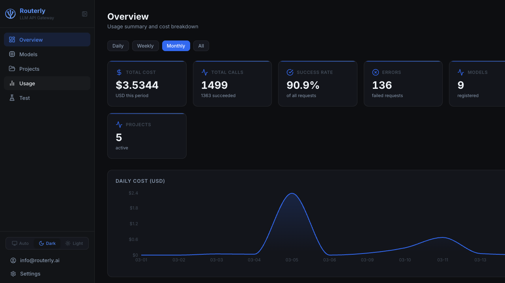
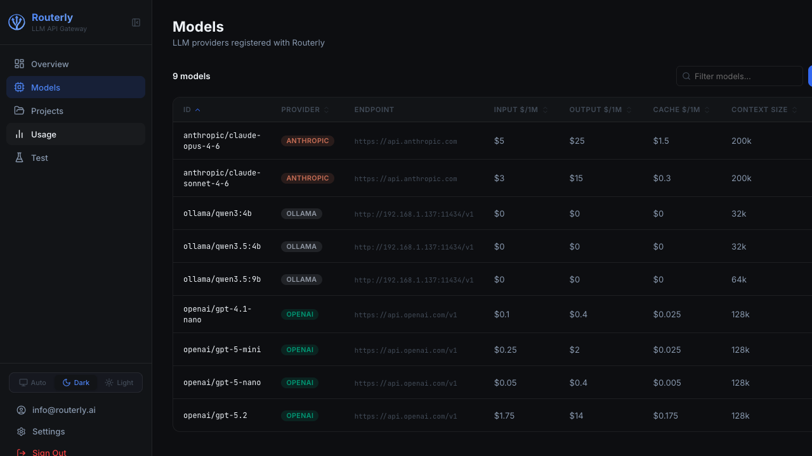
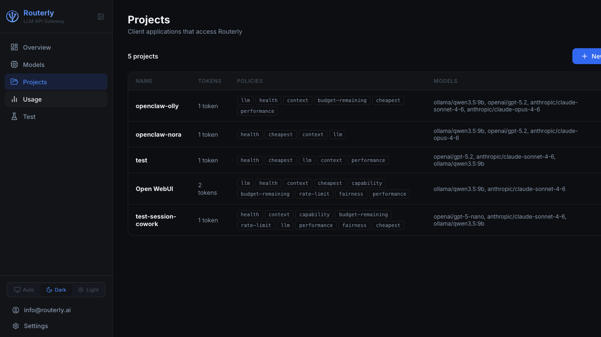
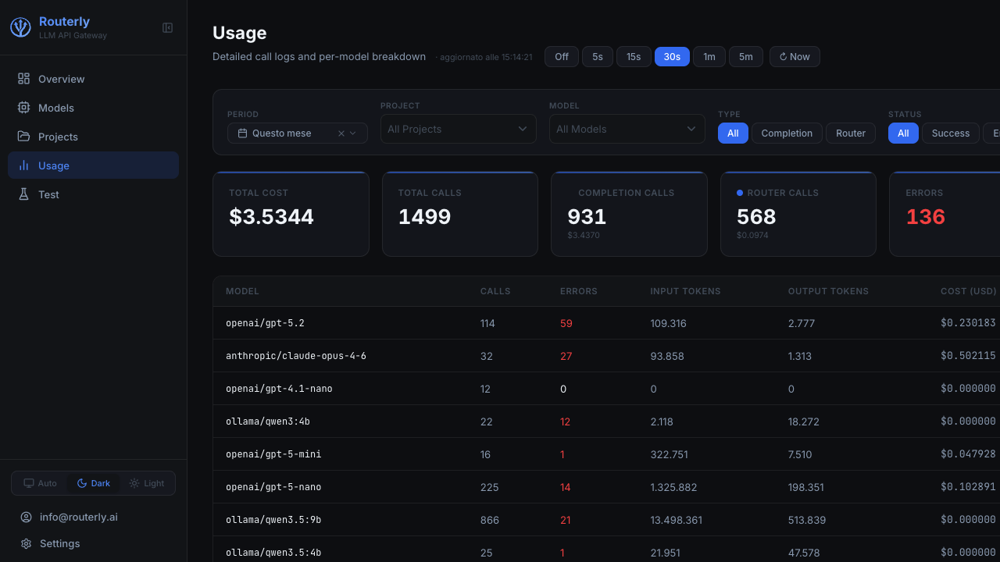

<div align="center">
  
  <h1>Routerly</h1>
  <p><strong>One gateway. Any AI model. Total control.</strong></p>

  <p>
    Self-hosted LLM gateway with intelligent routing, cost tracking, and budget enforcement.<br>
    Fully compatible with the OpenAI and Anthropic APIs, swap a URL, nothing else changes.
  </p>
  <p>
    <a href="https://www.routerly.ai/">https://www.routerly.ai/</a>
  </p>
  <p>
    
    
    
    
    <a href="https://hub.docker.com/r/inebrio/routerly"></a>
    
    
    <a href="https://cla-assistant.io/Inebrio/Routerly"></a>
    
    
    
  </p>
</div>

---

## Quick Start

**macOS / Linux:**
```bash
curl -fsSL https://www.routerly.ai/install.sh | bash
```

**Windows (PowerShell):**
```powershell
powershell -c "irm https://www.routerly.ai/install.ps1 | iex"
```

**Docker:**
```bash
docker run -d \
  --name routerly \
  -p 3000:3000 \
  -v routerly_data:/data \
  -e ROUTERLY_HOME=/data \
  --restart unless-stopped \
  inebrio/routerly:latest
```

```bash
routerly model add --id gpt-4o --provider openai --api-key sk-YOUR_KEY
routerly project add --name "My App" --slug my-app --models gpt-4o
routerly start
```

Open `http://localhost:3000/dashboard` to manage models, projects, and monitor usage in real time.
Your app connects to `http://localhost:3000` using the project token as the API key.

**Learn more:** [Dashboard guide](docs/dashboard/README.md) — [CLI reference](docs/cli/README.md) — [Installation options](docs/getting-started/installation.md)

---

<!-- ## Demo


> A request enters, the router picks the best model, costs update in real time.

--- -->

## Why Routerly?

- **Intelligent routing**: 9 configurable policies score every request in parallel — cheapest, fastest, healthiest, most capable, or LLM-native (uses an AI to decide which AI to use)
- **Zero infrastructure**: no database, no Redis, no PostgreSQL — config lives in a JSON file
- **Drop-in compatible**: swap the base URL in your client. Nothing else changes. Supports both OpenAI and Anthropic native formats
- **Free forever**: self-hosted, AGPL-3.0, you pay only what your providers charge — zero markup

---

## How Routerly compares

> Routerly is the only gateway that combines self-hosting, native Anthropic support, and LLM-powered routing — with zero external dependencies.

| | **Routerly** | **LiteLLM** | **OpenRouter** |
|---|:---:|:---:|:---:|
| Self-hosted | ✅ | ✅ | ❌ cloud-only |
| OpenAI-compatible API | ✅ | ✅ | ✅ |
| Native Anthropic API format | ✅ | ❌ | ❌ |
| Local model support (Ollama) | ✅ | ✅ | ❌ |
| BYOT (Bring Your Own Token) | ✅ | ✅ | ❌ |
| LLM-powered smart routing | ✅ | ❌ | ❌ |
| Built-in deterministic routing policies | ✅ | ⚠️ limited | ❌ |
| Budget enforcement | ✅ | ✅ | ✅ |
| Database required | ✅ none | ⚠️ SQLite/PostgreSQL | N/A |
| External infrastructure (Redis, etc.) | ✅ none | ⚠️ optional | N/A |
| Per-project token isolation | ✅ | ✅ | ✅ |
| Web dashboard | ✅ built-in | ✅ | ✅ |
| Admin CLI | ✅ | ✅ | ❌ |
| Data privacy (stays on your infra) | ✅ | ✅ | ❌ |
| Setup complexity | minimal | moderate | none (managed) |
| SSO / LDAP login | 🔜 | ✅ | ❌ |
| Configurable notifications | 🔜 | ⚠️ limited | ❌ |

**Routerly is the only option where the gateway itself is intelligent.** LiteLLM and OpenRouter are proxies, they forward requests based on static rules you define upfront. Routerly uses a language model to dynamically evaluate every request in context and pick the best candidate in real time. That means smarter cost savings, better fallback decisions, and routing that adapts to your workload automatically. And if you don't want to involve an LLM, Routerly's built-in deterministic policies (cheapest, health, performance, capability, budget-remaining…) work entirely on their own, no external call needed.

**BYOT, Bring Your Own Token.** With OpenRouter you pay through their platform at marked-up rates, effectively handing your spend and your usage data to a third party. Routerly uses your own API keys directly: every request goes straight from your server to the provider, at the provider's official price, with nobody in between.

**Privacy-first by design.** With OpenRouter, your prompts transit a third-party cloud, full stop. LiteLLM is self-hosted but requires standing up and maintaining a database just to run. Routerly is self-hosted, zero-dependency, and your data never leaves your machine. No Postgres, no Redis, no infrastructure to secure.

**The only gateway with native Anthropic format support.** If you're using the Anthropic SDK directly, not wrapped through OpenAI compatibility, only Routerly handles `/v1/messages` natively. LiteLLM and OpenRouter translate everything to OpenAI format, which means edge cases, subtle incompatibilities, and features like `top_k` or extended thinking that silently don't work.

> **Routerly** is the right choice for the vast majority of teams: self-hosted, intelligent, zero-ops, BYOT, with native support for both OpenAI and Anthropic formats.
> LiteLLM makes sense only if you specifically need one of its 100+ niche provider integrations and are prepared to run and maintain a database.
> OpenRouter is a last resort when you have no server to deploy to and data privacy is not a concern.

---

## Use Cases

### SaaS with multiple tenants
You run a product where different customers have different AI budgets. Create one Routerly project per tenant, assign a monthly spend cap, and let the routing engine automatically pick the cheapest model that fits the request, no code changes in your app, no risk of a single tenant blowing up your OpenAI bill.

### Local-first development
Your team develops against Ollama locally and promotes to GPT-4o in production. Routerly handles both with the same API surface. Point `base_url` at Routerly in all environments and change only the project token, the routing policy handles the rest.

### Cost optimisation without quality loss
You have a mix of cheap fast models and expensive powerful ones. Configure a project with `cheapest` + `capability` + `context` policies: Routerly will automatically route simple short requests to the cheap model and fall back to the powerful one only when the task demands it. No changes to your application logic.

### Resilience and automatic failover
Your production app can't afford downtime when a provider has an outage. Register the same logical capability across multiple providers (e.g. GPT-4o + Claude Sonnet + Gemini Pro) and enable the `health` policy. Routerly detects errors in real time and routes around failing endpoints, your app gets a 200 while the provider is down.

---


### Intelligent Multi-Policy Routing
Each request is scored against up to 9 pluggable routing policies, applied simultaneously and combined into a final ranking. Routerly picks the best candidate, and falls back automatically if a provider fails.

| Policy | What it does |
|--------|-------------|
| `llm` | Asks a language model to pick the best candidate given request context |
| `cheapest` | Minimises cost per token |
| `health` | Deprioritises models with recent errors |
| `performance` | Favours models with lower average latency |
| `capability` | Matches models to task requirements (vision, tools, JSON mode…) |
| `context` | Filters models by context window size relative to the prompt |
| `budget-remaining` | Excludes models that would push a project over its budget |
| `rate-limit` | Steers traffic away from rate-limited providers |
| `fairness` | Balances load across candidates |

### Real-Time Cost Tracking & Budgets
Every request is priced at the token level using up-to-date pricing per model. Costs accumulate per project and per token, and you can set hard limits, hourly, daily, weekly, monthly, or per request, that block overspending before it happens.

### Project Isolation
Separate Bearer tokens per project. Each project has its own model list, routing policies, and budget envelope. Perfect for multi-tenant setups or separating dev/staging/production traffic.

### Web Dashboard
A built-in React dashboard gives you a live view of spending, call volume, error rates, and per-model breakdown, with real-time auto-refresh. No separate monitoring tool needed.

### Admin CLI
A full-featured command-line tool lets you manage models, projects, users, roles, and pull usage reports, scriptable and CI-friendly.

---

## Dashboard



*Overview dashboard: real-time cost breakdown by model and project*



*Model registry: configure providers, endpoints and pricing*



*Project isolation: separate tokens, budgets and routing per tenant*



*Usage breakdown: filter by time range, model and project*

---

## Works with any OpenAI or Anthropic client

Because Routerly is a wire-compatible proxy, every tool that speaks the OpenAI or Anthropic protocol works without modification.

<div align="center">

| Tool | Protocol | Notes |
|------|----------|-------|
|  | OpenAI | Python, Node.js, .NET, Java, Go, all versions |
|  | Anthropic | Python and Node.js SDKs, including streaming |
|  | OpenAI | Set the API base URL in Settings → Connections |
|  | Anthropic | Points to `http://localhost:3000` as a custom endpoint |
|  | OpenAI | Use `ChatOpenAI` with `base_url` override |
|  | OpenAI | `OpenAI(api_base=...)` constructor |
|  | OpenAI | Add a custom model via Settings → Models |
|  | OpenAI | `config.json`, set `apiBase` to Routerly URL |
|  | OpenAI | Configure as a custom OpenAI endpoint |
| Any `fetch`/`curl` | OpenAI / Anthropic | Standard HTTP, no SDK needed |

</div>

**Python example (OpenAI SDK):**
```python
from openai import OpenAI

client = OpenAI(
    base_url="http://localhost:3000/v1",
    api_key="your-project-token"       # token generated by `routerly project add`
)
response = client.chat.completions.create(
    model="gpt-4o",
    messages=[{"role": "user", "content": "Hello!"}]
)
```

**Python example (Anthropic SDK):**
```python
import anthropic

client = anthropic.Anthropic(
    base_url="http://localhost:3000",
    api_key="your-project-token"
)
message = client.messages.create(
    model="claude-opus-4-6",
    max_tokens=1024,
    messages=[{"role": "user", "content": "Hello!"}]
)
```

---

## Supported Providers

| Provider | Key required | OpenAI format | Anthropic format | Local |
|----------|:------------:|:-------------:|:----------------:|:-----:|
| **OpenAI** | ✓ | ✓ | - |, |
| **Anthropic** | ✓ | - | ✓ | - |
| **Google Gemini** | ✓ | ✓ | - |, |
| **Ollama** | - | ✓ | - | ✓ |
| **Mistral** | ✓ | ✓ | - |, |
| **Cohere** | ✓ | ✓ | - |, |
| **xAI (Grok)** | ✓ | ✓ | - |, |
| **Custom HTTP** | optional | ✓ | - | optional |

Mix and match freely. A single project can span cloud and local models simultaneously.

---

## Benchmarks

Independent benchmarks are published in the **[routerly-benchmark](https://github.com/Inebrio/routerly-benchmark)** repository.
Reproducible tests measure routing latency overhead, cost savings across workloads, and failover behaviour under simulated provider outages.

---

## Documentation

Full documentation is available at **[https://docs.routerly.ai](https://docs.routerly.ai)**.

| | |
|---|---|
| [Installation](docs/getting-started/installation.md) | One-line install, Docker Hub image, build from source |
| [Quick Start](docs/getting-started/quick-start.md) | First model, project, and API call in 5 minutes |
| [Configuration](docs/getting-started/configuration.md) | Settings file, environment variables, security |
| [Architecture](docs/concepts/architecture.md) | How the gateway works end-to-end |
| [Providers](docs/concepts/providers.md) | Supported providers and model catalogue |
| [Routing](docs/concepts/routing.md) | All 9 routing policies explained |
| [Budgets & Limits](docs/concepts/budgets-and-limits.md) | Cost caps, token limits, enforcement |
| [Dashboard](docs/dashboard/overview.md) | Web UI walkthrough |
| [CLI Reference](docs/cli/commands.md) | Every command with examples |
| [API Reference](docs/api/overview.md) | LLM proxy and management API |
| [Self-Hosting Guide](docs/guides/self-hosting.md) | Docker, systemd, nginx, production checklist |
| [Service](docs/service/overview.md) | HTTP server internals, routing engine, provider adapters |
| [Integrations](docs/integrations/overview.md) | Cursor, Open WebUI, LangChain, LibreChat, and more |

---

## Configuration

All configuration lives in `~/.routerly/`, plain JSON, no database.

```
~/.routerly/
├── config/
│   ├── settings.json    # port, log level, dashboard toggle
│   ├── models.json      # providers + AES-256 encrypted API keys
│   ├── projects.json    # projects + encrypted tokens
│   ├── users.json       # dashboard users
│   └── roles.json       # RBAC roles and permissions
└── data/
    └── usage.json       # per-call usage records
```

Override the base path with `ROUTERLY_HOME=/custom/path`.

**When running via Docker**, config and data are persisted in the `routerly_data` named volume, mounted at `/data` inside the container (`ROUTERLY_HOME=/data`). No extra setup needed: the directory is created automatically on first start.

---

## Contributing

Contributions are welcome. See the [Development Guide](docs/contributing/development.md).

---

## Roadmap

### Multi-Channel Notifications
Get alerted when a budget threshold is crossed, a provider goes down, or error rates spike, on the channel you already use. Notifications are fully configurable: Slack, email, webhooks, PagerDuty, and more. Each rule can target a different channel with its own severity filter.

### Enterprise SSO
Log in to the dashboard with your existing identity provider, Google, Microsoft Entra ID, GitHub, Keycloak, any OAuth 2.0 / OIDC provider, or LDAP. No separate user management required: roles and permissions sync automatically from your directory. Purpose-built for corporate and enterprise environments where user accounts are already centrally managed.

### Enterprise / corporate environment
Rolling Routerly out across a company where IT already manages identities in Azure AD, Okta, or LDAP. SSO login means your team logs into the dashboard without a separate password, access follows the same joiner/mover/leaver process as every other internal tool, and you can enforce MFA at the identity-provider level. Budget alerts on Slack or email keep finance and engineering teams in sync without anyone polling a dashboard.

---

## License

Routerly is licensed under [AGPL-3.0](LICENSE).
For commercial licensing inquiries: carlo.satta@routerly.ai

