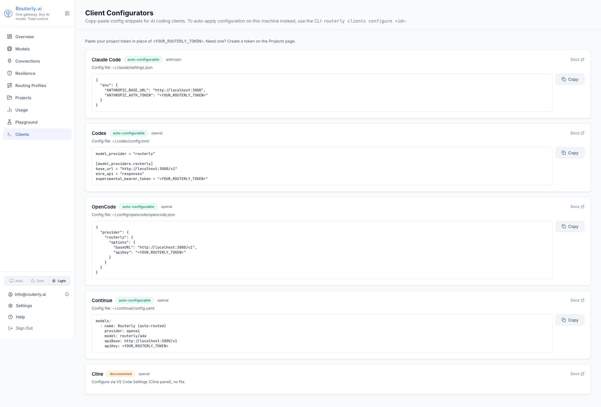

# Dashboard: Clients

The Clients page is a **discovery and copy-paste** reference for pointing
local AI coding clients (Claude Code, Codex, OpenCode, Continue, Cline) at
this Routerly instance. It is read-only: there is nothing to save here.

:::note Auto-apply is CLI-only
The dashboard cannot write files on your workstation. To actually apply a
client's config file automatically, use the CLI:
`routerly clients configure <id>`. See [CLI: `routerly
clients`](../cli/commands.md#routerly-clients) for the full command
reference (`configure`, `undo`, `doctor`, `inspect`, `launch`).
:::

---

## Clients List

Navigate to `/dashboard/clients`.



The nav item is only shown if the client-configurator module is enabled on
the server. If it is disabled, the page shows an empty state pointing at
**Settings → Modules**.

Each client is shown as a card with:

| Element | Description |
|---------|-------------|
| **Label + support badge** | `auto-configurable` / `launchable` (green), `documented` / `partial` (amber), `stale` (red) |
| **Wire format** | `openai` or `anthropic` |
| **Config file** | The path the client reads its settings from, or a note that it has none (Cline) |
| **Snippet** | The exact config body to paste, with a `<YOUR_ROUTERLY_TOKEN>` placeholder. The dashboard never has a raw project token to embed |
| **Copy button** | Copies the snippet to your clipboard |
| **Docs link** | Opens the matching manual page under [Integrations: Auto-configure](../integrations/overview.md#auto-configure) |

Cline's card has no snippet or Copy button (`documented`, no config file),
just the config-path hint and a Docs link to its manual VS Code Settings
walkthrough.

## Using a Snippet

1. Copy the snippet for your client.
2. Paste it into the client's config file (path shown on the card).
3. Replace `<YOUR_ROUTERLY_TOKEN>` with a real project token: create one on
   the [Projects](./projects.md) page (**Create a token** link on this page
   jumps there directly).
4. Save. Most clients (Continue, Claude Code) pick up the change
   automatically; others may need a restart.

## Auto-Apply from the CLI

Instead of copy-pasting, run the CLI on the same machine as the client to
write the file for you (with an automatic backup first):

```bash
routerly clients configure claude-code --project my-api
```

See [CLI: `routerly clients`](../cli/commands.md#routerly-clients) for the
full command reference, and one manual guide per client under
[Integrations: Auto-configure](../integrations/overview.md#auto-configure).
