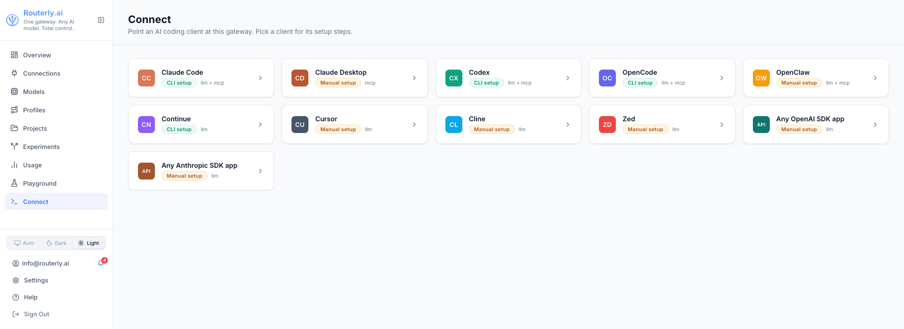

# Dashboard: Connect

**Connect** is the discovery section for pointing a local AI client at this
Routerly instance. It lists every client Routerly knows about and, for each
one, shows the exact steps to connect it. It is read-only: there is nothing
to save here.

:::note Writing config files is CLI-only
The dashboard cannot write files on your workstation. To apply a client's
config file automatically, run the CLI on the machine where the client is
installed: `routerly clients configure <id>`. See [CLI: `routerly
clients`](../cli/commands.md#routerly-clients) for the full command
reference (`configure`, `undo`, `doctor`, `inspect`, `launch`).
:::

---

## The client grid

Navigate to `/dashboard/connect`.



The nav item is only shown if the client-configurator module is enabled on
the server. If it is disabled, the page shows an empty state pointing at
`routerly modules enable clients`. The Overview page carries a shortcut card
to this section under the same condition.

Each client is a tile with:

| Element | Description |
|---------|-------------|
| **Mark + label** | The client's monogram and name |
| **Support badge** | `CLI setup` (green) when the CLI can write the config, `Manual setup` (amber) when the steps are by hand, `Partial support` (amber), `Out of date` (red) |
| **Modes** | `llm`, `mcp`, or `llm + mcp` — whether the client can route its model traffic through Routerly, load Routerly as an MCP server, or both |

Selecting a tile opens that client's page.

## A client page

`/dashboard/connect/<id>` shows everything needed for one client:

| Section | Shown when | Content |
|---------|------------|---------|
| **Header** | always | Support badge, wire format (`openai` or `anthropic`), connect modes, and a link to the client's full documentation page |
| **Configure from the CLI** | the client is auto-configurable | The `routerly clients configure <id>` command to copy and run |
| **Manual steps** | the client has a config file or environment setup | The config path and the exact block to paste |
| **MCP server** | the client supports `mcp` | That client's own MCP configuration (`mcpServers`, `context_servers`, a TOML section, or a command) plus the command that mints an MCP token |

Every code block has a Copy button.

## Tokens are placeholders here

Snippets in the dashboard carry `sk-rt-YOUR_TOKEN` (and `<YOUR_MCP_TOKEN>`
for MCP), never a real credential: the dashboard has no raw project token to
embed. Replace the placeholder before saving the file.

- **Project tokens**, for LLM traffic, are created on the
  [Projects](./projects.md) page.
- **MCP tokens** are personal: create them under **Profile → MCP** or with
  `routerly mcp token create --label <name>`.

The CLI does this for you: `routerly clients configure <id> --project my-api`
mints a token when you do not pass `--token`, and writes the file with the
real value.

## Applying a snippet by hand

1. Open the client page and copy the snippet.
2. Paste it into the client's config file, at the path shown.
3. Replace the placeholder token with a real one.
4. Save. Most clients pick the change up on the next request; some need a
   restart.

Then check the connection from the same machine:

```bash
routerly clients doctor
```

See [CLI: `routerly clients`](../cli/commands.md#routerly-clients) for the
command reference, and [Integrations: Connect a
client](../integrations/overview.md#connect-a-client) for one manual guide
per client.
