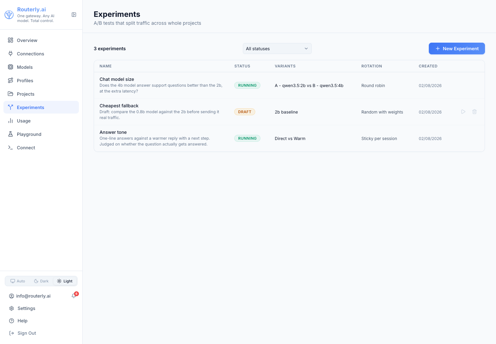
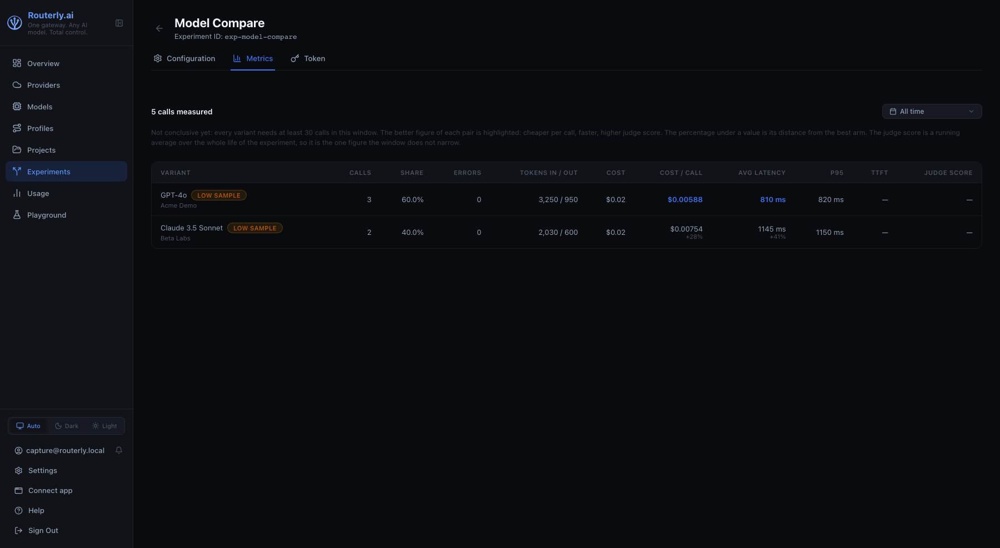

# Dashboard: Experiments

The Experiments section runs A/B tests that split live traffic across whole
projects. See [Concepts: Experiments](../concepts/experiments.md) for what a
variant is, how the rotation picks one, and how the numbers are computed.

Navigate to `/dashboard/experiments`.

The **Experiments** entry appears in the sidebar only when the `experiments`
module is enabled and your role has `experiments:read`. With the module off
the entry is hidden; modules are turned on from the CLI
(`routerly modules enable experiments`, then restart the service). See
[Settings: Modules](./settings.md#modules-tab).

---

## Experiments List

| Column | Description |
|--------|-------------|
| **Name** | A link to the experiment, with its description underneath when it has one, plus a `No token` badge when no client can reach it yet |
| **Variants** | What the test compares, by name: each variant's label, or the project it routes to when it has none |
| **Rotation** | How traffic is split: Sticky per session, Random with weights, Round robin |
| **Created** | Creation date |

The counter on the left shows how many experiments there are.

**Delete** is the only row action, and needs `experiments:manage`. The name is
the link into the experiment, so opening one needs no separate action.

Deleting asks for confirmation and warns that the experiment's tokens stop
working immediately.

**New Experiment** opens the same form as the Configuration tab, on an empty
experiment. It requires `experiments:manage`.

Without `experiments:read` the page renders an explicit "no permission"
state rather than an empty list.

---

## Experiment Detail

Opening an experiment shows its name and id, with three tabs.

### Configuration Tab

The whole design of the test, and the form used to create one.

**Basics**

| Field | Notes |
|-------|-------|
| **Name** | Required |
| **Description** | Optional, what the test is trying to settle. Shown in full under the name in the list |
| **Minimum calls per variant** | Below this the Metrics tab marks the comparison as not conclusive. Defaults to 30 |

**Traffic split**

**Rotation** offers the three strategies, each with its own one-line
explanation shown under the field. Choosing **Sticky per session** reveals
**Sticky on**, which decides what identifies "the same caller".

**Variants**

One row per arm: the **project** (searchable, required), an optional **label**
shown in place of the project name, and, when the rotation is weighted, a
**weight**. The weight field shows the resulting share as a percentage, live,
so `70` / `30` reads as 70% / 30% while you type. Rows can be added and
removed; a test needs at least two.

**Judge**

Off by default. Enabling it reveals:

| Field | Notes |
|-------|-------|
| **Judge model** | Any configured model |
| **Criteria** | Free text, one per line, they go into the judge's prompt |
| **Share of calls judged (%)** | Percentage of the experiment's calls to score, default 100 |

Every judged call is an extra model call on your own bill, which is why the
share exists.

Every field stays editable for the whole life of the experiment, including one
already serving traffic. Redesigning a test that already has traffic mixes two
different measurements under one set of numbers, so narrow the Metrics window
to the period after the change.

Creating an experiment returns its first token once, in a green panel with a
Copy button. It is not shown again.

Without `experiments:manage` the form is read-only and the save button is
hidden.

### Metrics Tab

One row per variant, over the selected window.

The **Time range** dropdown offers All time (the default), Last 24 hours, Last
7 days and Last 30 days. The counter on the left shows how many calls the
window measured.

| Column | Description |
|--------|-------------|
| **Variant** | Label with the project it routes to underneath, and a `Low sample` badge below the minimum |
| **Calls** | Client calls the variant served |
| **Share** | That variant's percentage of the calls measured in the window |
| **Errors** | Failed calls, with the rate |
| **Cost** | USD across those calls |
| **Cost / call** | Average per call |
| **Avg latency** | Mean end-to-end latency |
| **p95** | 95th percentile latency |
| **Judge score** | Mean judge verdict out of 10, with the judged-call count next to it |

The best value in **Cost / call**, **Avg latency** and **Judge score** is
highlighted in the accent colour. A tie highlights nothing, and a column with
fewer than two comparable values highlights nothing.

While any variant is below the minimum, a line above the table reads "Not
conclusive yet" and names the threshold. With no calls in the window at all,
the tab shows an empty state pointing at the experiment token.

### Token Tab

The tab opens with the base URL to point a client at, with a Copy button: it
is this instance's own address plus `/v1`, the same one projects use.

The tokens clients call to reach the experiment. Same shape as a project's
tokens: only the first characters of each are ever shown again, with its
creation date and last use.

**New Token** reveals the raw value once, with a Copy button. **Revoke**
deletes a token after confirmation, and any client still using it starts
failing immediately.

A client calls the experiment exactly like a project: same base URL, this
token in place of a project token. Each request lands on one variant and is
billed to that variant's project.

---

## Surfaces

- Concepts: [Experiments](../concepts/experiments.md)
- CLI: [`routerly experiments`](../cli/commands.md#routerly-experiments)
- API: [Experiments](../api/management.md#experiments)
