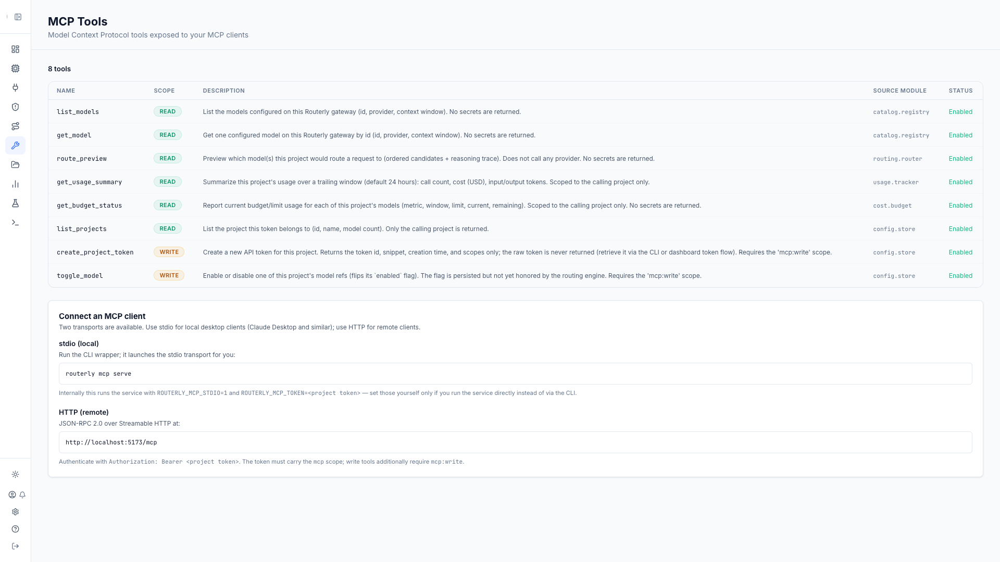

# Dashboard: MCP Tools

The MCP Tools page is a read-only browser for the tools Routerly's
[MCP server](../concepts/mcp.md) exposes to MCP clients (Claude Code, Claude
Desktop, and similar), plus a panel with the exact commands/URLs needed to
connect a client.

Navigate to `/dashboard/mcp`.

Without `mcp:read`, the page shows a permission-denied empty state and never
calls the API.

---

## Tools Table

| Column | Description |
|--------|-------------|
| **Name** | Tool name, e.g. `list_models` |
| **Scope** | `READ` (green badge) or `WRITE` (amber badge); write tools additionally require the calling project token to carry `mcp:write` |
| **Description** | What the tool does |
| **Source module** | The backing service module's internal DI key, e.g. `catalog.registry`, `config.store` |
| **Status** | `Enabled`: a tool is only listed at all when its backing module is bootstrapped, so every row shown here is enabled |

Routerly ships 9 built-in tools (7 read, 2 write); see
[Concepts: MCP Server](../concepts/mcp.md#the-built-in-tools) for what each
one does. A tool whose backing module isn't running on this instance (e.g.
`get_metrics_snapshot` without the observability module) is absent from the
table entirely, not shown as disabled.

If no tools are installed, an empty state is shown instead of the table.

---

## Connect an MCP Client

A static panel below the table gives the exact connection details for both
transports:

- **stdio (local)**: run `routerly mcp serve`, which internally sets
  `ROUTERLY_MCP_STDIO=1` and `ROUTERLY_MCP_TOKEN=<project token>` and spawns
  the service. Point a local client's MCP config at this command.
- **HTTP (remote)**: JSON-RPC 2.0 over Streamable HTTP at
  `<your Routerly origin>/mcp`, authenticated with
  `Authorization: Bearer <project token>`. The token must carry the `mcp`
  scope; write tools additionally require `mcp:write`.

The token itself is never shown here; mint one with the scopes it needs
from [Projects: Tokens Tab](./projects.md#tokens-tab) or
`routerly project token create <project> --scopes mcp,mcp:write`.

---

## Related

- [Concepts: MCP Server](../concepts/mcp.md): what the MCP server is, both transports, scopes, and the full tool list
- [API: MCP Tools](../api/management.md#mcp-tools): `GET /api/mcp/tools` endpoint reference
- [CLI: `routerly mcp`](../cli/commands.md#routerly-mcp): `tools`, `test`, `serve`
- [Dashboard: Projects: Tokens Tab](./projects.md#tokens-tab): setting a token's `mcp`/`mcp:write` scopes
