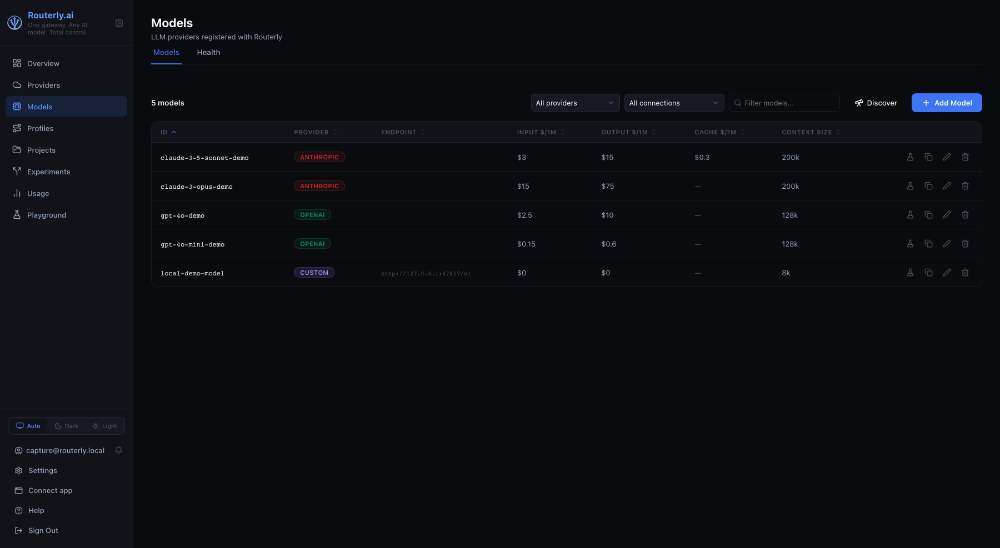
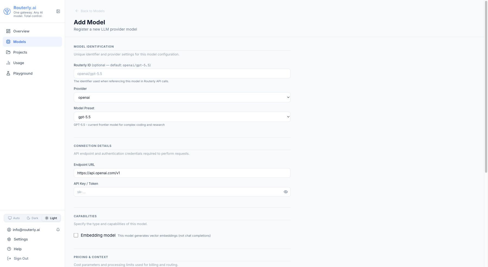
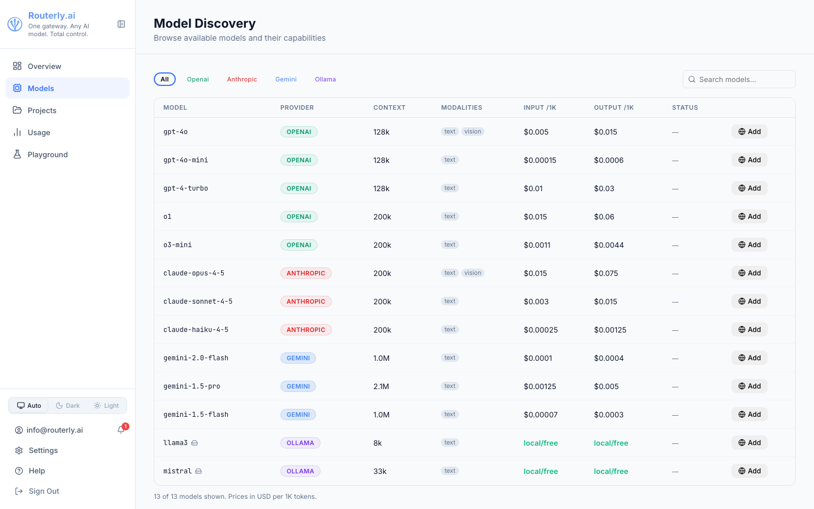

# Dashboard: Models

The Models page lets you register, edit, clone, and remove LLM models. All models registered here become available for use in project routing configurations.

Health status is shown inline in the same table as configuration -- no separate tab is needed.

---

## Model List

### Filtering and Search

- **Provider filter** -- dropdown to show models for a single provider (OpenAI, Anthropic, Ollama, etc.) or all providers.
- **Search** -- text search by model ID, filtered live as you type.

Results are paginated at 20 models per page.

### Model List Columns

| Column | Description |
|--------|-------------|
| **ID** | Provider model identifier |
| **Provider** | Provider badge |
| **Endpoint** | Base URL used for this model |
| **Input $/1M** | Input token price in USD |
| **Output $/1M** | Output token price in USD |
| **Cache $/1M** | Cache read price (if applicable) |
| **Context Size** | Maximum context window tokens |
| **Status** | `Healthy`, `Unavailable` -- based on recent error rate. Shows a neutral badge when no traffic has been recorded yet |
| **Error Rate (5M)** | Percentage of failed requests in the last 5 minutes |
| **P95 Latency (5M)** | 95th-percentile response time in the last 5 minutes |
| **Requests (1H)** | Total requests in the last hour |
| **Last Success** | Time of the most recent successful request |
| **Cooldown** | Remaining cooldown if the model triggered rate-limiting |

Health columns show a dash when no data is available for the window. The health data refreshes automatically every 30 seconds (visible in the subtitle bar).

Click any column header to sort.

:::note Redirected from /dashboard/health
The standalone Provider Health page has been merged into this page. `/dashboard/health` redirects to `/dashboard/models`.
:::

### Adding a Model

1. Click **+ Add Model**
2. Fill in the form:
   - **Model ID** -- the identifier sent to the provider (e.g. `gpt-5-mini`)
   - **Provider** -- select from the dropdown
   - **API Key** -- encrypted at rest; leave blank for Ollama / custom models without auth
   - **Base URL** -- optional override (useful for proxies or self-hosted models)
   - **Context Window** -- pre-filled for known models
   - **Pricing** -- input/output/cache prices per 1M tokens; pre-filled for known models
   - **Pricing Tiers** -- add a tier for long-context pricing (e.g. Anthropic above 200k tokens)
   - **Capabilities** -- check all that apply

3. Click **Save**

:::tip Adding from the catalog
Use the **Model Discovery** page (navigate to **Models**, then click **Discover**) to browse the built-in catalog. Clicking **Add** next to any entry opens the new-model form with the **Provider** and **Model ID** already filled in, and pre-populates pricing and context window from the catalog entry. You only need to supply the API key.
:::

### Editing a Model

Click the **Edit** (pencil) icon next to a model. All fields except the Model ID are editable.

To update the API key, enter a new value -- Routerly re-encrypts it immediately.

#### Catalog Tracking and Field Overrides

Models linked to the catalog show status badges on editable fields:

- **Auto** (green badge) — field is synced from the catalog; your edit will override it
- **Override** (amber badge) — field is manually locked to your custom value; it will not auto-sync
- No badge — model is not in the catalog (local Ollama, custom endpoint) or field is always manual (API key, enabled status)

**To override a catalog field:** edit it normally. The badge changes to "Override" and the field is locked. An edit indicator appears showing the catalog default value.

**To reset an overridden field:** click the **Reset** button next to it. The field reverts to the catalog value and the override lock is removed. Auto-sync resumes.

The override status is saved with the model; if you edit the same model again, your locks persist.

### Cloning a Model

Click the **Clone** icon to create a copy of a model entry. Useful when registering a fine-tuned variant that shares the same provider and pricing as a base model.

Change the **Model ID** and **API Key** as needed, then save.

### Disabling a Model

Toggle the **Enabled** switch to `off` to temporarily remove a model from routing without deleting it. Disabled models are visible in the list but are excluded from all routing decisions.

### Removing a Model

Click the **Delete** (trash) icon. You will be asked to confirm.

:::warning
Removing a model that is assigned to active project routing configurations will cause routing failures for those projects. Remove the model from all project routing configs before deleting it.
:::

---

## Model Discovery

Navigate to `/dashboard/models/discover` (or click **Discover** on the Models page) to browse the built-in model catalog. The catalog lists known models from supported providers with their context window and published pricing.

| Column | Description |
|--------|-------------|
| **Model** | Model ID (sortable) |
| **Provider** | Provider name (sortable) |
| **Context** | Maximum context window, e.g. `128k`, `1.0M` (sortable) |
| **Input /1M** | Input price per 1,000,000 tokens; `free` for zero-priced models (sortable) |
| **Output /1M** | Output price per 1,000,000 tokens (sortable) |

Click any column header to sort ascending; click again to reverse. All five columns are sortable.

**Filters (two rows):**

- **Search** — filter by model ID or name substring
- **Provider** — multi-select dropdown; leave empty to show all providers
- **Context** — limit by context window size: All, <32k, 32k–200k, 200k–1M, >1M
- **Price /1M** — filter by input price tier: All, Free, <$1, $1–$5, >$5
- **Show** — All, Configured only (models already added to Routerly), Embedding only

Click **Reset filters** to clear all filters at once.

Click **Add** next to any model to open the new-model form with that model's details pre-filled. Pricing and context window are populated automatically from the catalog. You only need to supply the API key to complete registration.
