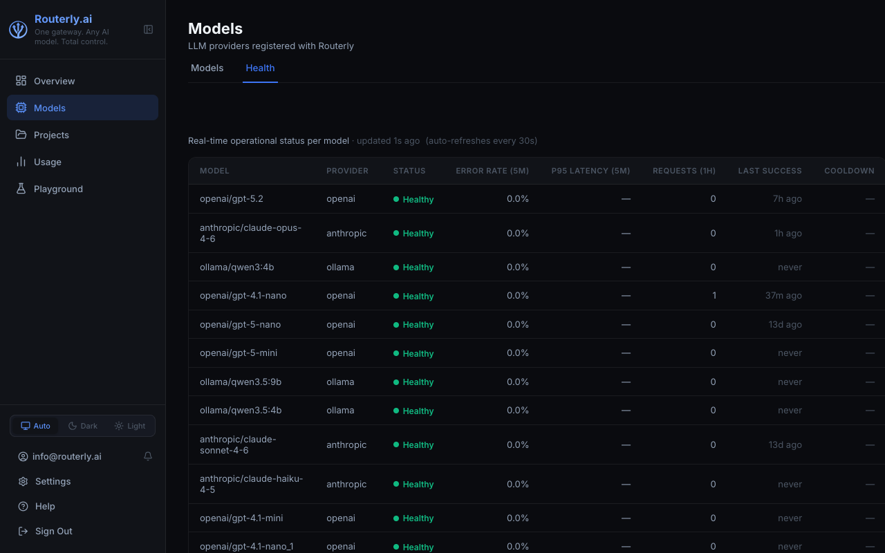

# Dashboard: Models

The Models page lets you register, edit, clone, and remove LLM models. All models registered here become available for use in project routing configurations.

The page has two tabs: **Models** (the registry) and **Health** (real-time provider status).

---

## Models Tab

### Filtering and Search

- **Provider filter** — dropdown to show models for a single provider (OpenAI, Anthropic, Ollama, etc.) or all providers.
- **Search** — text search by model ID, filtered live as you type.

Results are paginated at 20 models per page.

### Model List Columns

| Column | Description |
|--------|-------------|
| **ID** | Provider model identifier |
| **Provider** | Provider badge |
| **Endpoint** | Base URL used for this model |
| **Input $/1M** | Input token price in USD |
| **Output $/1M** | Output token price in USD |
| **Cache $/1M** | Cache read price (if applicable) |
| **Context** | Maximum context window tokens |

Click any column header to sort.

### Adding a Model

1. Click **+ New Model**
2. Fill in the form:
   - **Model ID** — the identifier sent to the provider (e.g. `gpt-5-mini`)
   - **Provider** — select from the dropdown
   - **API Key** — encrypted at rest; leave blank for Ollama / custom models without auth
   - **Base URL** — optional override (useful for proxies or self-hosted models)
   - **Context Window** — pre-filled for known models
   - **Pricing** — input/output/cache prices per 1M tokens; pre-filled for known models
   - **Pricing Tiers** — add a tier for long-context pricing (e.g. Anthropic above 200k tokens)
   - **Capabilities** — check all that apply

3. Click **Save**

:::tip Adding from the catalog
Use the **Model Discovery** page (navigate to **Models**, then click **Discover**) to browse the built-in catalog. Clicking **Add** next to any entry opens the new-model form with the **Provider** and **Model ID** already filled in, and pre-populates pricing and context window from the catalog entry. You only need to supply the API key.
:::

<!-- TODO screenshot: models-new-prefilled (model form opened from catalog Add button with provider+model pre-filled) (deferred, service down) -->

### Editing a Model

Click the **Edit** (pencil) icon next to a model. All fields except the Model ID are editable.

To update the API key, enter a new value — Routerly re-encrypts it immediately.

### Cloning a Model

Click the **Clone** icon to create a copy of a model entry. Useful when registering a fine-tuned variant that shares the same provider and pricing as a base model.

Change the **Model ID** and **API Key** as needed, then save.

### Disabling a Model

Toggle the **Enabled** switch to `off` to temporarily remove a model from routing without deleting it. Disabled models are visible in the list but are excluded from all routing decisions.

### Removing a Model

Click the **Delete** (trash) icon. You will be asked to confirm.

:::warning
Removing a model that is assigned to active project routing configurations will cause routing failures for those projects. Remove the model from all project routing configs before deleting it.
:::

---

## Health Tab

The Health tab shows real-time operational status for each model. Data is refreshed every 30 seconds automatically.

| Column | Description |
|--------|-------------|
| **Model** | Provider model identifier |
| **Provider** | Provider name |
| **Status** | `Healthy`, `Degraded`, or `Down` — based on recent error rate |
| **Error Rate (5M)** | Percentage of failed requests in the last 5 minutes |
| **P95 Latency (5M)** | 95th-percentile response time in the last 5 minutes |
| **Requests (1H)** | Total requests in the last hour |
| **Last Success** | Time of the most recent successful request |
| **Cooldown** | Remaining cooldown if the model triggered rate-limiting |

:::note Redirected from /dashboard/health
The standalone Provider Health page has moved. `/dashboard/health` now redirects to `/dashboard/models?tab=health`.
:::

---

## Model Discovery

Navigate to `/dashboard/models/discover` (or click **Discover** on the Models page) to browse the built-in model catalog. The catalog lists known models from supported providers with their context window, modalities, and published pricing.

<!-- TODO screenshot: models-discover (discovery catalog page) (deferred, service down) -->

| Column | Description |
|--------|-------------|
| **Model** | Model ID; `★` marks models already configured in your Routerly instance |
| **Provider** | Provider name |
| **Context** | Maximum context window (e.g. `128k`, `1.0M`) |
| **Modalities** | Supported input types (e.g. `text`, `image`) |
| **Input /1K** | Input price per 1,000 tokens; shown as `free/local` for zero-priced or local models |
| **Output /1K** | Output price per 1,000 tokens |

Filter by **provider** using the tabs above the table, or use the search box to narrow by model ID.

Click **Add** next to any model to open the new-model form with the provider and model ID pre-filled. Pricing and context window are also pre-populated from the catalog entry; supply the API key to complete registration.
