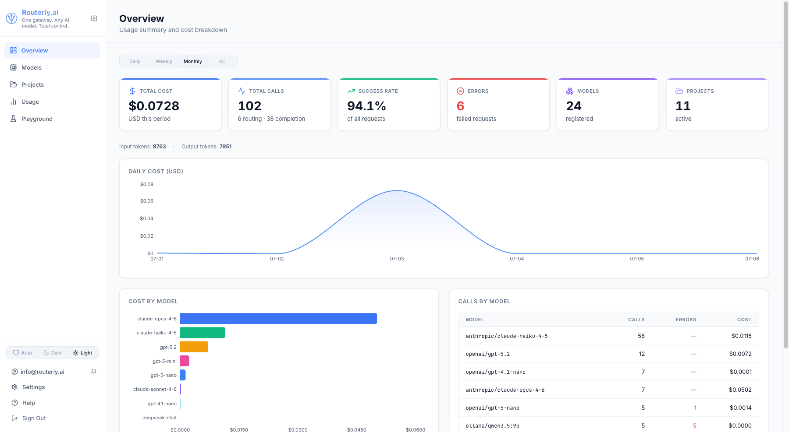

# Overview

The Overview page is the dashboard home screen. It shows a snapshot of activity across all projects for the selected time period.

---

## Period Selector

A segmented control at the top of the page switches between four reporting windows:

| Option | Description |
|--------|-------------|
| **Daily** | Today, broken down by hour (00:00–23:00) |
| **Weekly** | Current calendar week (Monday–Sunday) |
| **Monthly** | Current calendar month |
| **All** | All recorded activity |

The entire page — cards, charts, and tables — updates instantly when you switch periods.

---

## Summary Cards

The top row shows aggregate numbers for the selected period:

| Card | Description | Links to |
|------|-------------|----------|
| **Total Cost** | Sum of all LLM costs in USD | [Usage](usage.md) |
| **Total Calls** | Number of API requests, with a routing vs. completion breakdown in the sub-text | [Usage](usage.md) |
| **Success Rate** | Percentage of requests that returned a successful response | [Usage](usage.md) |
| **Errors** | Number of failed requests (provider errors, budget exceeded, and so on) | [Usage](usage.md) |
| **Models** | Number of registered models | [Models](models.md) |
| **Projects** | Number of projects | [Projects](projects.md) |

Every card is a link to the section that explains its number, so a figure that looks wrong is one click from the records behind it.

---

## Token Strip

Below the summary cards, a strip shows aggregate token counts for the period:

| Metric | Description |
|--------|-------------|
| **Input tokens** | Total prompt tokens sent to providers |
| **Output tokens** | Total completion tokens received |
| **Cached tokens** | Tokens served from the provider's prompt cache (counted at the reduced cached rate) |

---

## Cost Over Time Chart

An area chart shows cost over time for the selected period. The chart adapts its granularity to the selected window:

- **Daily**: one point per hour of the current day
- **Weekly / Monthly**: one point per day; days with no activity show zero (no interpolation)
- **All**: one point per day across the full history

---

## What Routing Saved

Under the cost chart, a card compares the traffic that actually happened with the same traffic sent to a single model: the **costliest** target model the projects in the window allow, which is the worst case the routing avoided. The model is named in the card header and links to [Models](models.md).

Above the chart, a strip totals the period:

| Figure | Description |
|--------|-------------|
| **Saved** | Baseline cost minus actual cost, and the same as a percentage. Red when the routing came out more expensive |
| **Actual** | What the compared calls cost |
| **Baseline** | What they would have cost on the baseline model |
| **Time** | Measured total time against the estimated baseline total, shown only when the baseline has enough samples to estimate from |

A segmented control switches what the chart plots:

| Metric | Solid line | Dashed line |
|--------|-----------|-------------|
| **Cost** | USD actually spent per bucket | The same calls priced at the baseline model |
| **Tokens** | Input tokens per bucket | Output tokens per bucket (both solid: tokens have no counterfactual) |
| **Speed** | Measured milliseconds per call | Estimated milliseconds per call on the baseline |

The dashed line is always the counterfactual: something that did not happen. Buckets with no comparable call are left out rather than drawn as zero, so a gap in the line means there was no traffic.

Only client calls count. Routing and guardrail calls are the gateway's own overhead and are excluded, as are calls that carry no tokens. The same numbers are available from [`routerly report savings --trend`](../cli/commands.md#routerly-report-savings) and from `GET /api/usage?series=1` ([API: Savings series](../api/management.md#savings-series)).

:::note Repricing is an estimate, not a replay
The cost figures are exact arithmetic on the observed token counts, but a different model tokenizes the same text slightly differently and may answer at a different length. Read the baseline as "the same conversation, priced elsewhere". Measuring the real difference needs a live comparison, which is what [Experiments](experiments.md) are for.
:::

---

## Cost by Model Chart

A horizontal bar chart ranks the top eight models by cost for the period. Models with no cost in the period are left out. Hovering a bar shows the full model ID and its cost.

---

## Calls by Model Table

A table below the chart breaks down activity per model for the selected period:

| Column | Description |
|--------|-------------|
| **Model** | Model ID as registered in Routerly |
| **Calls** | Total requests routed to this model |
| **Errors** | Number of failed requests for this model |
| **Cost** | Total cost in USD |

Rows are sorted by call count descending.

---

## Navigating to Details

- Click any summary card to open the section that explains it: [Usage](usage.md), [Models](models.md) or [Projects](projects.md).
- The baseline model named in **What Routing Saved** links to [Models](models.md), where its price and targets are configured.
- Use the **Usage** item in the sidebar for the full analytics page with filtering and drill-down by project, model, or date range.
- Click a project name in the sidebar to go directly to that project's configuration.
