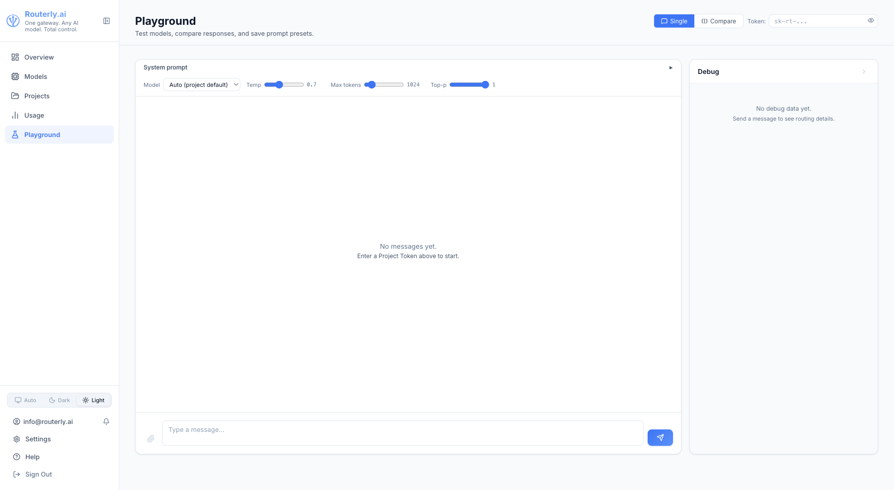
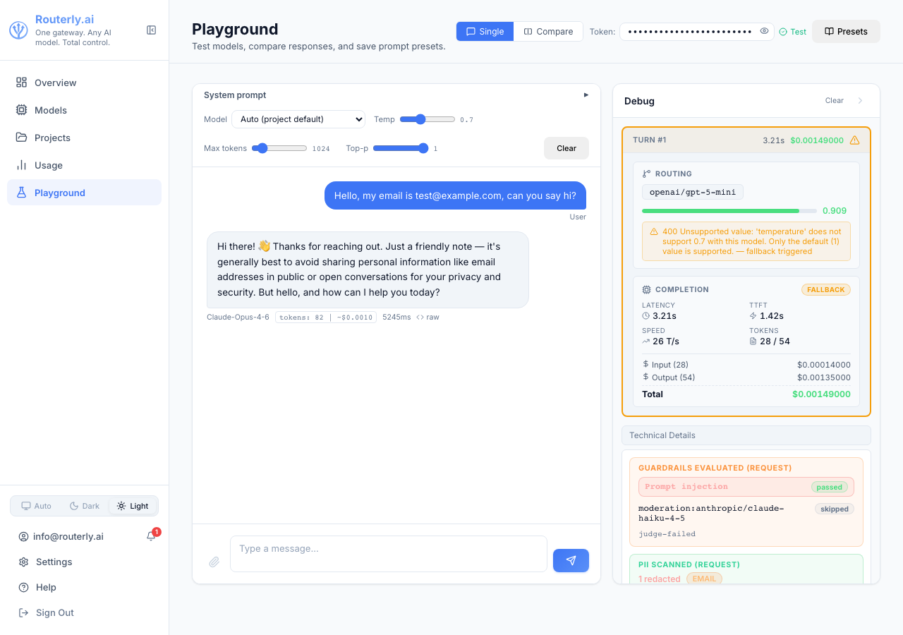

# Dashboard: Playground

The Playground lets you send chat requests directly from the browser without writing any code. It is useful for testing models, verifying routing behaviour, and debugging prompt changes.

---

## Getting Started

1. Open **Playground** from the sidebar
2. Enter a **Project Token** in the Token field (top right) — paste an `sk-rt-...` token from any project you have access to
3. Type a message in the input box at the bottom and press **Send** (or `Enter`)

---

## Interface

### Message History

Messages are displayed in a conversational thread. Each message shows:
- The role (`user` / `assistant`)
- The content (with Markdown rendering for assistant responses)
- For image inputs: a thumbnail

The conversation history is maintained for the duration of the browser session and sent with each request as `messages` context.

### Mode

Use the **Single** / **Compare** toggle (top right) to switch between a single-model chat and a side-by-side comparison view.

### Model Display

The model actually used is shown above each assistant response. If routing assigned a different model than expected, this is where you'll see it.

### Streaming

Responses stream in real time when the selected project's routing configuration supports streaming. A stop button (⏹) appears while a response is in progress — click it to abort.

### Image Attachments

Click the **Attach Image** button (or paste an image) to include image content in your message. This requires the routed model to have the `vision` capability.

---

## Guardrail Block Indicator

When a security rule with `action: Block` triggers, the response area shows a
red **"[Request/Response] blocked by guardrail"** banner above the (empty) reply
bubble. The banner displays:

| Field | Description |
|-------|-------------|
| **Rule** | The rule identifier that triggered (e.g. `regex`, `injection:dan-mode`) |
| **Target** | Whether the block was on the `request` or `response` |
| **Action** | Always `block` for this banner |
| **Fallback message** | The project's configured fallback text (if set) |

The wire response seen by your application is a standard `finish_reason: "content_filter"` (OpenAI) or `stop_reason: "refusal"` (Anthropic) HTTP 200 — not an error. The Playground reads the trace to surface the richer block details shown in the banner.

## Debug Panels

The **Debug** sidebar (right side of the screen) shows one collapsible section per conversation turn. Expand a turn to see:

| Panel | Contents |
|-------|----------|
| **Turn summary** | Model used, token counts, latency |
| **Technical Details** | Full routing trace: policy scores, selected model, guardrail evaluation, PII scan results |

These panels are invaluable for understanding why the router chose a specific model, diagnosing provider errors, or confirming that guardrails and PII scrubbing fired correctly.

### Guardrails Evaluated

When guardrails are configured on the project, the Technical Details section shows a **GUARDRAILS EVALUATED (REQUEST)** block after every request — whether or not any rule fired. Each row represents one rule that ran:

| Column | Meaning |
|--------|---------|
| Rule name | The rule identifier from your guardrail config, e.g. `regex:pattern`, `semantic:topic`, or `Prompt injection` for the built-in injection check |
| Outcome chip | `passed` (green) — the rule ran and did not match. `triggered` (red) — the rule matched; the request was blocked or flagged. `skipped` (grey) — the rule did not run, e.g. its judge model was unavailable. |
| Reason | Shown below the rule name on skipped or scored rules, e.g. `judge-failed`, `semantic:82%`, `moderation:score=0.94` |

The **Prompt injection** row (highlighted in red) represents the built-in injection detector. It is enabled per project via the `detectInjection` guardrail flag on the project Security tab or via `routerly project guardrails`.

Use this block to answer: "Did the guardrail actually run? Which rule matched? Was prompt injection detected?"

### PII Scanned

When PII scrubbing is active, the Technical Details section always shows a **PII SCANNED (REQUEST)** and/or **PII SCANNED (RESPONSE)** block — even when nothing was redacted. This confirms that scrubbing ran.

| State | Display |
|-------|---------|
| Nothing redacted | `0 redacted` (clean) |
| Entities redacted | `N redacted` with entity-type pills, e.g. `EMAIL`, `PHONE_NUMBER` |

When entities were redacted, a separate **PII SCRUBBED** block (orange) also appears listing the replaced entity types.

:::note
All trace data is fetched out-of-band via the trace store using the `x-routerly-trace-id` response header. The wire response returned to your application is never modified to include trace information.
:::

---

## Clearing the Conversation

Click **Clear** to reset the message history. The system prompt (if any) is preserved.

---

## Limitations

- The Playground does not save conversations after a page refresh.
- Function-calling / tool-use responses are shown as raw JSON.
- Audio and document inputs are not supported via the Playground UI.
