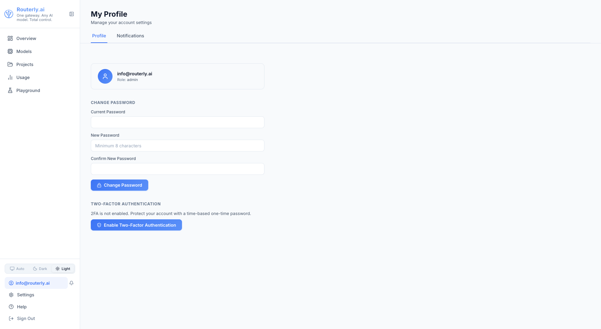
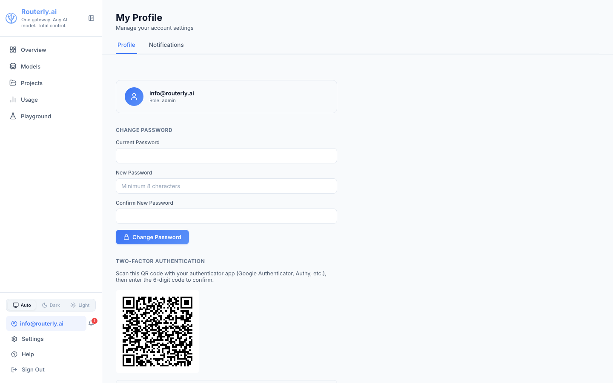
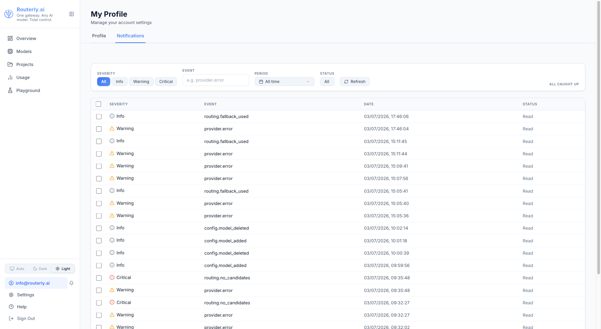

# Dashboard: Profile

The Profile page lets each logged-in user manage their own account settings and view their personal notification inbox. Access it by clicking your email address in the sidebar (bottom-left of the screen).

---

## Profile Tab

### Changing Your Password

1. Enter your **Current Password**
2. Enter your **New Password** (minimum 8 characters)
3. Re-enter the new password in **Confirm New Password**
4. Click **Change Password**

Routerly hashes passwords with bcrypt. Your current session remains active after a password change.

### Two-Factor Authentication

Enable TOTP-based 2FA under the **Two-Factor Authentication** section.

When you click **Enable Two-Factor Authentication**, the setup panel renders a scannable **QR code image** generated directly from the `otpauth://` URI. Open any TOTP authenticator app (Google Authenticator, Authy, 1Password, etc.) and scan the QR code. If your app does not support camera scanning, the underlying setup key (base32 secret) is still shown below the image so you can enter it manually.

Enter the 6-digit code from your authenticator app to confirm setup. Once enabled, you will be prompted for a TOTP code on every login.

### Account Information

The profile card shows your **email address** and your **role**.

---

## Notifications Tab {#notifications-tab}

The Notifications tab is your personal in-app notification inbox.

It shows all notification events routed to you via any `dashboard` channel that includes you in its targets (or all events when no targeting is configured). Items are listed newest-first and include the event type, severity icon, and age.

### Unread Badge

The notification bell icon next to your email address in the sidebar shows an unread count badge when new items arrive. Click the bell icon to open a quick-view popup showing the latest few notifications. Navigate to the **Notifications** tab here for the full inbox.

### Marking as Read

Items are marked as read when you open them. Use `POST /api/notifications/inbox/read` with `{ "all": true }` to mark all as read programmatically, or `routerly notification read` from the CLI.

---

## Navigation

Access the Profile page from the sidebar: click your email address (bottom-left of the sidebar, above Settings).
