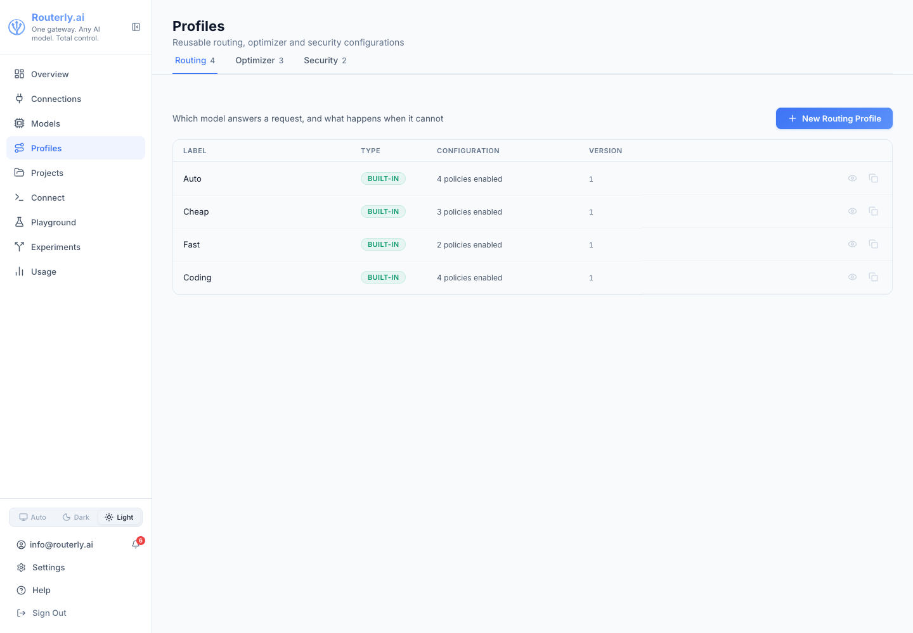

# Dashboard: Profiles

The Profiles page manages reusable configurations that any number of projects
can adopt. A profile comes in one of three kinds:

| Kind | What it bundles |
|------|-----------------|
| **Routing** | the ordered policy list |
| **Optimizer** | the ordered list of optimizer steps and which of them are enabled |
| **Security** | content guardrail rules and PII redaction policies |

A project can be assigned one profile per kind, independently: routing from a
profile, security custom, optimizer from another profile. See
[Projects](./projects.md#routing-tab) for the assignment controls.

Navigate to `/dashboard/profiles`.

See [Concepts: Routing](../concepts/routing.md) for each routing policy's
behaviour and parameters.

---

## Profiles List

The page opens on three tabs, one per kind: **Routing**, **Optimizer**,
**Security**. Each tab shows how many profiles it holds and lists only those,
with a one-line reminder of what that kind configures. Routing is the tab the
page opens on.

| Column | Description |
|--------|-------------|
| **Label** | Display name of the profile |
| **Type** | `Built-in` (read-only) or `Custom` (user-created, editable) |
| **Configuration** | One-line summary of what the profile configures |
| **Version** | Increments by 1 on every edit |

A tab with no profiles shows a kind-specific empty state (for example
`No security profiles yet.`).

Routerly ships these built-in profiles:

- Routing: **Auto**, **Cheap**, **Fast**, **Coding**
- Optimizer: **Safe**, **Balanced**, **Aggressive**
- Security: **Standard**, **Strict**

Built-in profiles cannot be edited or deleted, so their row shows a **View**
(read-only) button instead of Edit. Custom profile rows show **Edit** and
**Delete** with `profiles:manage`. Every row has a **Clone** button with
`profiles:manage`.

Without `profiles:read`, the page shows a permission-denied empty state.
Without `profiles:manage`, every row is view-only and the create button is
hidden.

---

## Creating a Profile

Each tab has its own create button, named after the kind it creates: **New
Routing Profile**, **New Optimizer Profile**, **New Security Profile**. It
opens `/dashboard/profiles/new?kind=<kind>`, one form per kind, headed the
same way. There is no kind to pick on the form: the three kinds share no
field beyond the label.

1. Enter a **Label**
2. Fill in the configuration (see the per-kind editors below)
3. Click **Create Profile**

To create a profile of another kind, go back and use that tab's button: the
stored configuration shape depends on the kind, so an existing profile never
changes kind.

### Cloning

The **Clone** button on a list row opens the same form pre-filled with that
profile's configuration and a `<label> copy` label, on the source profile's
kind. Nothing is written until **Create Profile** is clicked, so a clone can
be adjusted before it exists.

---

## Editing a Profile

Click **Edit** on a custom profile row to open `/dashboard/profiles/<id>`.
**Save Profile** persists the change and bumps `version` by 1; **Cancel**
returns to the list without writing.

Built-in profiles open in the same page read-only: the fields are visible but
not editable and no save button is shown. Clone one to customize it.

### Routing configuration

- **Policies**: `health`, `context`, `capability`, `budget-remaining`,
  `rate-limit`, `semantic-intent`, `llm`, `performance`, `fairness`,
  `cheapest`, `model-preference`. Drag to reorder, toggle **Enabled**, remove
  with the trash icon, or add one from the **Add a policy...** dropdown. A
  policy's advanced `config` (when present) is edited as raw JSON; invalid
  JSON blocks saving until fixed.

The selector and the fallback strategy are not editable from the dashboard:
the engine defaults (`argmax` and `next-best`) apply to every profile created
here. A profile that already carries other values keeps them when it is
edited or cloned, and the [API](../api/management.md#profiles) still accepts
both fields.

### Optimizer configuration

The list of installed optimizer steps, in execution order. Drag to reorder and
toggle each step on or off. Steps that are installed but absent from the
profile are listed after the configured ones, so enabling one is a single
click.

### Security configuration

- **Content Guardrails**: `regex`, `semantic`, `topic` and `moderation` rules,
  each with a target (`request`, `response` or `both`) and per-target actions.
  Semantic, topic and moderation rules need a judge model, picked from the
  models configured on this instance
- **PII Policies**: which entities to redact and on which target

Both editors are the same ones the project Security tab uses, so a profile and
an inline project configuration are always edited identically.

---

## Deleting a Profile

Click **Delete** (trash icon) on a custom profile row. A confirmation dialog
warns the action cannot be undone.

Delete can fail with:
- **In use**: a project currently has this profile assigned. Unassign it from
  every project (switch those projects back to Custom, or assign a different
  profile) before deleting.
- **Built-in**: built-in profiles cannot be deleted at all; the Delete button
  is not shown for them.

---

## Related

- [Concepts: Routing: Routing Profiles](../concepts/routing.md#routing-profiles): what a routing profile is, built-in presets, selectors, fallback strategies
- [API: Profiles](../api/management.md#profiles): endpoint reference
- [CLI: profiles](../cli/commands.md#routerly-profiles): the same operations from the terminal
- [Dashboard: Projects](./projects.md#routing-tab): assigning profiles to a project
