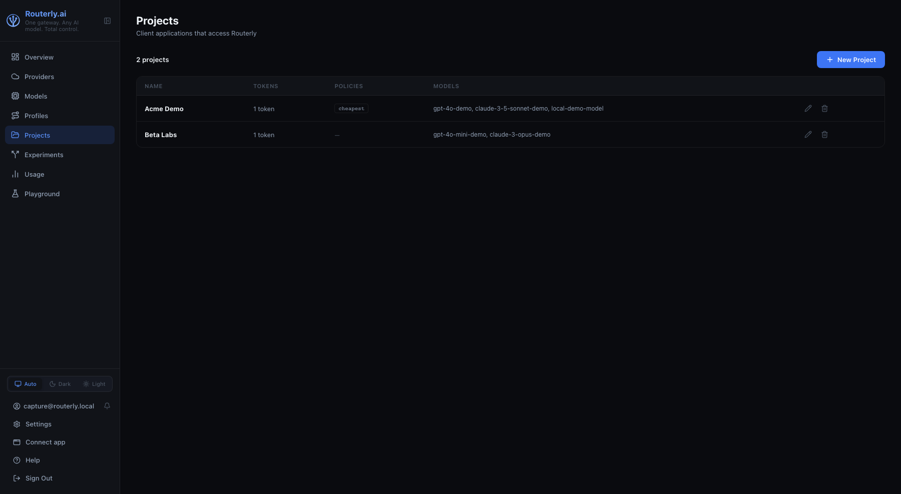
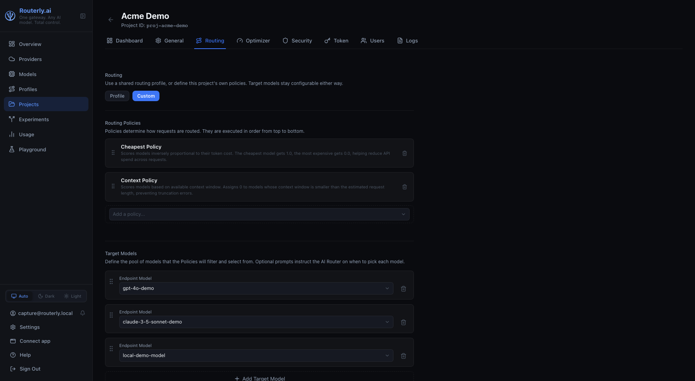
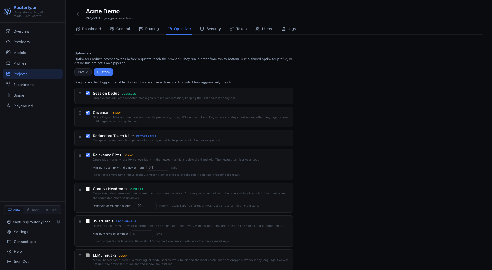

# Dashboard: Routers

The Routers page gives you an overview of all routers and provides access to each router's configuration.

---

## Routers List

The list has four columns: name, number of tokens, active routing policies, and assigned target models.

Click any router to open its detail view, which has eight tabs.

---

## Dashboard Tab

The landing page of a saved router: what the routing achieved over a period you pick with the date range selector at the top. A router that has never been called shows an empty state instead, and a router that has not been created yet has no Dashboard tab at all.

| Card | Reading |
|------|---------|
| **Savings** | Money the routing avoided compared with sending every call to the router's most expensive target model |
| **Cost** | What the traffic actually cost, and how many calls it took |
| **Latency** | Median response time, with p95 underneath. Router and guardrail calls are excluded: they are gateway overhead, not client-visible time |
| **Time to first token** | Median TTFT with p95. Reads `not measured on these calls` when no record in the window carried a TTFT |
| **Reliability** | Share of successful calls, with error and blocked counts underneath |

Below the cards: input, output and prompt-cached token totals with the money the cache saved.

**If everything had gone to one model** is the counterfactual table, one row per enabled target model of the router. Costs are the observed tokens repriced at that model's rates, so they are exact arithmetic on what actually happened. Times are estimated from that model's own throughput in the same period, so a target with no traffic in the window shows `no sample` instead of a fabricated number.

**What the optimizers removed** appears once at least one optimizer changed a call in the period: one row per optimizer, with the calls it changed, the prompt tokens it removed, what those tokens would have cost, and how many of its results the safety gate rolled back. Unlike the counterfactual above it, these are measured on the calls as they were served, not repriced estimates. The section stays hidden when no optimizer ran, and on records written before 0.4.0, which never carry per-optimizer numbers. A high rollback count means that optimizer's threshold is set too aggressively for this router's traffic: tune it in the [Optimizer tab](#optimizer-tab).

**Where the traffic went** breaks the period down per model: calls, share of traffic, cost, p95 latency and errors.

The same figures are available headless with [`routerly report savings --router <id>`](../cli/commands.md#routerly-report-savings).

:::note Repricing is not a replay
A different model tokenizes the same text slightly differently and may answer at a different length. Read a row as "the same conversation, priced elsewhere", not as a guarantee.
:::

---

## General Tab

Shows and lets you edit:

- **Name** — display name for the router
- **Slug** — URL-safe identifier (read-only after creation)
- **Timeout (TTFT)** — how long a model attempt may take to produce its first token, in milliseconds. Defaults to `2000`; `0` waits as long as the provider takes
- **Trace content** — off by default. Traces always record metadata (models, scores, guardrail outcomes, tokens, cost, latency); turn **Capture prompts and answers** on to also record the message contents. They are stored with the usage record, shown in the [Usage](usage.md#trace-view) trace view and the [Playground](playground.md#debug), included in [exported traces](settings.md#exporting-traces), and visible to anyone who can read reports. CLI equivalent: `routerly router edit <router> --trace-content`
- **Connection Info** — base URL and masked token snippet ready to copy into your SDK configuration
- **Budget** — router-level cost limit (daily / monthly)

---

## Routing Tab

Configure which models this router can use and how to select between them.

### Routing Profile

At the top of the tab, a **Profile** / **Custom** switch decides where this
router's routing comes from. Target models stay configurable in both modes.

**Profile** assigns a shared [routing profile](./profiles.md). A dropdown
lists the built-in profiles first (labelled `(built-in)`), then any custom
ones; selecting one **saves immediately**, independently from the **Save
Routing Configuration** button below. The inline policy editor is hidden:
policies, selector and fallback strategy all come from the profile and follow
its later edits, which are made on the [Profiles](./profiles.md) page.

**Custom** clears the assignment and restores this router's own inline
policies. Switching from Profile to Custom pre-loads the assigned profile's
policies into the editor as a starting point; they are not persisted until
**Save Routing Configuration** is clicked, so the copy can be edited or
discarded first.

### Adding Models

Use the **+ Add Model** button to pick from registered models. Models appear in a numbered list — their order determines the default routing priority (position 0 is highest).

Drag and drop to reorder.

### Adding Policies

Drag policies from the policy panel on the right into the active-policies list on the left. Each policy can be expanded to configure its parameters.

Available policies: `cheapest`, `health`, `performance`, `capability`, `context`, `llm`, `rate-limit`, `fairness`, `budget-remaining`.

See [Concepts: Routing](../concepts/routing.md) for each policy's behaviour and parameters.

---

## Optimizer Tab

Configure this router's prompt/context optimizer pipeline: a per-router,
ordered list of optimizers that reduce a request's token footprint before it
is forwarded to a provider.

**Required permission:** `optimizers:read` to view the tab; `optimizers:manage` to toggle, reorder, edit thresholds, or save.

### Optimizer Profile

A **Profile** / **Custom** switch at the top of the tab decides where the
pipeline comes from, exactly like the [Routing tab](#routing-profile). In
**Profile** mode a dropdown assigns a shared
[optimizer profile](./profiles.md); the assignment saves immediately and the
pipeline editor is replaced by a read-only list of the profile's enabled
steps. Switching to **Custom** clears the assignment and pre-loads those steps
into the editor, unsaved, so they can be adjusted before **Save Optimizers**.

The switch is only shown with `optimizers:manage`.

### Optimizer Rows

All 8 installed optimizers are listed, one per row, in pipeline execution
order:

- **Checkbox**: enable/disable this optimizer for the router
- **Name and description**: the optimizer's display name, its class
  (`Lossless.` / `Recoverable.` / `Lossy.`), and a one-line summary of its
  behavior
- **Threshold**: shown only on the optimizers that take one, labelled with
  what it actually controls (`Recent turns to keep` for `ccr`,
  `Reserved completion budget` for `headroom`, `Minimum rows to compact` for
  `json-table`, `Minimum overlap with the newest turn` for `relevance`,
  `Fraction of tokens to keep` for `llmlingua-2`). The field carries the
  accepted range, its unit next to the input, and a line saying which way to
  move it. Left empty it uses the built-in default, shown as the input's
  placeholder. `session-dedup`, `rtk` and `caveman` have no threshold field
  at all
- **Drag handle**: drag rows to reorder; the pipeline runs top to bottom

Rows for optimizers not yet configured on the router appear disabled at the
end of the list; enabling one and saving adds it to `optimizers.steps`.

See [Concepts: Optimizers](../concepts/optimizers.md) for what each
optimizer does, its class, and which steps are language-bound, including the
[Threshold Range](../concepts/optimizers.md#threshold-range) each
optimizer's threshold accepts.

### The LLMLingua-2 Row

`llmlingua-2` runs on a downloaded model, so its row carries the download
rather than a separate box elsewhere on the page. It appears only on that
row, and only once the row is in the pipeline.

Its checkbox stays **disabled until at least one checkpoint is downloaded**:
the step is skipped on every request without one, so enabling it would do
nothing. An already-enabled step stays toggleable, so a pipeline can always
be turned off.

Under the description, one line per checkpoint: its name, size, licence note
and a **Download** button. What each line can show:

| State | What it looks like |
|-------|--------------------|
| Not downloaded | A **Download** button |
| Downloading | A progress bar with the percentage and, when the host reports sizes, `42% (76 of 182 MB)`. It polls every 3 seconds, so a page opened or refreshed mid-download picks the progress straight up |
| Downloaded | `Downloaded`, and the checkpoint becomes selectable |
| Failed | The host's error message and a **Retry** button |

The checkpoints live on the service host and are shared: every router that
picks one uses the same download. Which one *this* router's step runs on is
the **LLMLingua-2 checkpoint** dropdown below the list, offered once at least
one is downloaded; leaving it on **Default checkpoint** uses the one the host
marks `default`. Picking a checkpoint that is not downloaded warns that the
step will be skipped on every request until it is.

When the optional `@huggingface/transformers` dependency is missing on the
host, the row says so instead of offering a download: there is nothing to run
a checkpoint with. See [Concepts: Optimizers,
llmlingua-2](../concepts/optimizers.md#llmlingua-2) for the install.

Downloading needs `optimizers:manage`; with `optimizers:read` alone the
buttons are disabled and the states are still visible.

### Saving

Click **Save Optimizers** to persist the enabled/disabled state, order, and
thresholds. A row that is disabled and has no threshold set is not
persisted to `optimizers.steps`. Only enabled rows, or disabled rows with a
threshold, are written.

### Preview Panel

Below the pipeline editor, **Preview token savings** dry-runs the current
(unsaved) UI state of the pipeline against one prompt. No upstream call is
made and nothing is saved. It matches `POST /api/optimizers/preview` (see
[API: Optimizers](../api/management.md#optimizers)).

The **Prompt** dropdown chooses what to run it against:

- **Type a prompt below** (the default) keeps the free-text box, where you
  paste a sample user message
- Any other entry is one of the sample conversations shipped with Routerly.
  Picking one replaces the text box with that conversation, read-only, above
  a line saying which steps it exercises

Running a fixture is the point of the picker: a hand-typed sentence rarely
resembles the long, repetitive conversations optimizers work on, so it
under-reports what a pipeline would do in production. Each fixture is built
to trigger a different group of steps, and `long-context-en` is the one for
`headroom`, previewed against a model whose window is 32k or smaller.
Routerly does not record real prompts, so these conversations are the only
preview material (see [Concepts: Optimizers,
Privacy](../concepts/optimizers.md#privacy)).

The **Model** dropdown addresses the sample to a model, listing this
router's models (or every configured model when the router allows all of
them) with each one's context window on the label. Steps that trim to fit a
window need to know which window: on **No model** they are skipped, exactly
as they would be on a request naming a model Routerly has no window for.

Click **Run Preview** for tokens before, tokens after, tokens saved, and a
per-step breakdown. Clicking anywhere on a step row expands it to a word-level
diff of what that step changed: removed words struck through in red, added words in green,
compared against the previous step's output so the diff reads as a chain. A
step whose result the safety gate rejected is labelled **rolled back: the
change was rejected as unsafe** rather than shown as a no-op, and a step that
declined to run reads **skipped:** followed by its own reason (no context
window for the model, no repeated message, text that is not English, no JSON
array long enough, the checkpoint not downloaded). Both tell a zero saving
apart from a threshold set too aggressively.

---

## Tokens Tab

Manage Bearer tokens for this router.

### Creating a Token

1. Click **+ New Token**
2. Enter a **Name** (e.g. `production`, `staging`, `ci`)
3. Optionally add **Scopes**: free-form scopes (e.g. `batch`, `internal`)
   stored with the token for your own bookkeeping. Routerly does not
   interpret them. The [MCP server](../concepts/mcp.md) uses personal MCP
   tokens, not these scopes.
4. Optionally add **Tags** — key-value metadata (e.g., `environment: production`, `team: backend`). Tags are included in every usage record created with this token, enabling filtering and analysis by custom dimensions.
5. Optionally configure per-token limits (metric, limit value, window type, mode)
6. Click **Create**

The token value (`sk-rt-…`) is shown **once**. Copy it immediately.

### Per-Token Limits

Per-token limits let you cap spending for individual applications sharing the same router. The `mode` field controls how the per-token limit interacts with the router-level limit:

| Mode | Behaviour |
|------|-----------|
| `replace` | Per-token limit overrides the router limit for this token |
| `extend` | Both per-token and router limits must pass |
| `disable` | No budget check for this token |

### Rolling or Regenerating a Token

Click the **Re-generate** icon to invalidate the current token and issue a new one. The previous token stops working immediately.

### Editing a Token

Click a token's **Name** to open the edit view. Here you can:

- **Update Scopes**: add or remove access scopes without touching the token value itself.
- **Update Tags** — add, remove, or modify key-value metadata. Changes apply immediately to all future usage records created with this token.
- **Modify Limits** — add or remove spending limits without touching the token value itself.

Any changes to scopes, tags, or limits take effect immediately and do not invalidate the token.

---

## Users Tab

Assign dashboard users to this router. A user assigned here can see and manage the router based on their role's permissions.

Available roles: `viewer`, `editor`, `admin` (or any custom role defined in [Users & Roles](./users-and-roles.md)).

Clicking a member row puts it in edit mode, the same the **Edit** icon does; a row already being edited keeps the click for its inputs. Removing a member stays on its own button.

---

## Notification Routing

A router has no notifications tab. The scope lives on the channel: open **Settings → Notifications**, edit a channel, and pick the routers it covers in its **Routers** field. An empty field means every router.

Events are recorded in the in-app inbox regardless of channel scope, so narrowing a channel never hides an event from the [Inbox](./profile.md).

---

## Logs Tab

A live log of recent requests routed through this router.

| Column | Description |
|--------|-------------|
| Timestamp | When the request arrived |
| Model | Provider model that handled the request |
| Status | `success` (green), `blocked` (amber), `error` / `budget_exceeded` etc. (red) |
| Input Tokens | Number of input tokens |
| Output Tokens | Number of output tokens generated |
| Cost | Estimated USD cost |

A `blocked` status means a guardrail rule rejected the request before it reached any model. Zero tokens and zero cost are recorded.

Click any row to open the **Trace view** which shows the full routing decision: which policies ran, which models were considered, and why the final model was chosen.

The table auto-refreshes at a configurable interval. Use the interval selector (5 s / 15 s / 30 s / 1 min / 5 min / Off) to control polling.

---

## Security Tab

Configure request filtering and data protection for this router.

**Required permission:** `router:update`

### Security Profile

A **Profile** / **Custom** switch at the top of the tab decides where the
guardrails and PII policies come from, exactly like the
[Routing tab](#routing-profile). In **Profile** mode a dropdown assigns a
shared [security profile](./profiles.md); the assignment saves immediately and
the editors below are replaced by a read-only list of the profile's rules and
PII policies. Switching to **Custom** clears the assignment and pre-loads that
configuration into the editors, unsaved, so it can be adjusted before saving.

### Content Guardrails

Enable guardrails to evaluate requests and/or responses against an ordered list of independent rules. Each enabled rule is evaluated in sequence.

#### Injection Warning

When one or more rules have the **Inject** flag enabled, an amber warning banner appears above the rule list:

> "One or more rules inject their instruction into the outgoing request's system prompt. The request payload is modified. No extra judge call is made, and nothing is blocked."

This is a soft steering feature (no block, no judge call) and is fully transparent.

#### Rule Cards

Each rule card displays:
- **Type**: rule category (regex, semantic, topic, moderation)
- **Enabled** toggle: when off, this rule is skipped during evaluation
- **Scope flags** (topic/moderation only): three independent checkboxes:
  - **Request**: judge the user messages before they reach the model (hard block + log on trigger)
  - **Inject**: append this rule's instruction to the request system prompt so the model self-enforces (soft steer, no block). For topic rules, injects the allowed-topics description; for moderation, injects the custom instructions (or a built-in default).
  - **Response**: judge the model's response before it reaches the client (hard block + log on trigger)
  - At least one flag must be enabled. Inject-only rules (no Request or Response) skip the judge entirely.
- Scope options (regex/semantic only): Request, Response, or Both (no Inject option)
- Judge configuration fields (topic/moderation only; visible when Request and/or Response is checked):
  - **Judge Model**: dropdown of available judge models (filtered to exclude embedding-only models)
  - **Fallback Models** (optional): multi-select of fallback judge models tried in order if the primary is unavailable or errors
  - **Harm/Topic Threshold**: slider (0-1, default 0.5). For moderation, triggers when score > threshold. For topic, triggers when score < threshold (off-topic).
- Type-specific configuration fields:

| Type | Config |
|------|--------|
| **Regex** | Regex patterns (one per line, case-insensitive) |
| **Semantic** | Embedding model ID, optional fallback embedding models (multi-select, tried in order), example phrases to block, similarity threshold (0-1, default 0.82) |
| **Topic** | Allowed-topics description, score threshold (0-1, default 0.5) |
| **Moderation** | Custom instructions (required): instructions to inject or pass to the judge. Score threshold (0-1, default 0.5). |

##### Judge response (reason-first scoring)

For topic and moderation rules with a judge (Request and/or Response enabled), the judge is asked to respond with a reason first, then a fine-grained score from 0.00 to 10.00. The reason (in the user's language) becomes the block message when the rule triggers. The score is normalized to 0-1 before the threshold check. This anchored rubric prevents bimodal score collapse on small models.

##### Model selection

The model dropdowns are filtered by type:

- **Topic and Moderation** judges: show only non-embedding models (chat/completion models). Embedding-only models cannot act as LLM judges and are excluded.
- **Semantic** embedding field: shows only models with `capabilities.embedding = true`.

##### Fallback models

For topic, moderation, and semantic rules, the "Fallback models (optional, tried in order)" multi-select field allows selecting zero or more fallback models that will be tried in order if the primary model is unavailable or returns an error. If the primary model returns a budget-exceeded error, fallbacks are not tried (fail-closed on budget).

#### Streaming Interaction Notice

When a rule has the **Response** flag enabled (and thus requires buffering the response before the judge verdict), streaming is automatically disabled for the request, and the client receives the full response as a single chunk.

A clear notice box appears on the form when this condition is detected:

> "Responses will be buffered (no streaming) because one or more rules judge the response."

#### Consumer impact

When a judged rule has its Request or Response flag enabled and triggers, the request or response is rejected before reaching the model (or before being sent to the client). Routerly returns HTTP 200 with a wire-faithful content-filter response: `finish_reason: "content_filter"` (OpenAI) or `stop_reason: "refusal"` (Anthropic), with empty content. The block message (from the judge's reason field) is stored on the trace but does not appear in the wire response. API consumers that check `finish_reason`/`stop_reason` will detect the block; those that only read message content will receive an empty reply.

When a rule has only the Inject flag enabled (soft steering), the rule steers the model without calling the judge and does not block or log. The request is forwarded with no consumer-visible impact.

When a rule is skipped (disabled, unavailable model, judge error), the request is forwarded with no consumer-visible impact. The skipped rule is recorded on the usage record for audit purposes.

### PII Scrubbing

Enable PII scrubbing to automatically detect and replace sensitive data in requests before they reach the model, and optionally in responses before they are returned to the caller.

PII configuration uses a list of policies. Click **+ Add policy** to create a new policy. Each policy is displayed as "Policy 1", "Policy 2", etc. (1-based numbering). Each policy has:

- **Enabled** toggle: when off, this policy is skipped
- **Target**: request, response, or both (which side(s) to scrub)
- **Entity types**: checkboxes for EMAIL, PHONE, CREDIT_CARD, SSN, IBAN. All types are selected by default. Uncheck any type to exclude it from scrubbing.
- **Custom patterns**: optional regex patterns in addition to entity detection
- **Streaming buffer size**: (response scrubbing only) suffix buffer size in characters (10-500, default 30). Used to catch patterns spanning chunk boundaries when streaming. Only appears when Target includes response.

All enabled policies with the same direction (request/response) are merged at scrub time. When multiple response policies are active, the largest buffer size is used.

Matched values are replaced with typed placeholders:

| Entity Type | Placeholder | Notes |
|-------------|-------------|-------|
| `EMAIL` | `[EMAIL]` | Email addresses |
| `PHONE` | `[PHONE_NUMBER]` | Phone numbers (US and international formats) |
| `CREDIT_CARD` | `[CREDIT_CARD]` | Card numbers (PAN) |
| `SSN` | `[SSN]` | US Social Security Numbers |
| `IBAN` | `[IBAN]` | International Bank Account Numbers |

#### Consumer impact

PII scrubbing modifies message content before it reaches the model and/or before responses are returned to the caller. Original sensitive values are replaced with typed placeholders. The model receives and responds based on the modified version and cannot reference the original values.

API consumers calling this router's endpoint should be aware that their messages will be modified in-flight. If your application logic requires the model to see exact credit card numbers, email addresses, or phone numbers, disable scrubbing for those entity types. The usage record will include a `piiRedacted` field listing which entity types were detected and scrubbed.

### Saving Security Settings

Click **Save Security Settings** at the bottom of the tab. The button displays a green checkmark on successful save.
