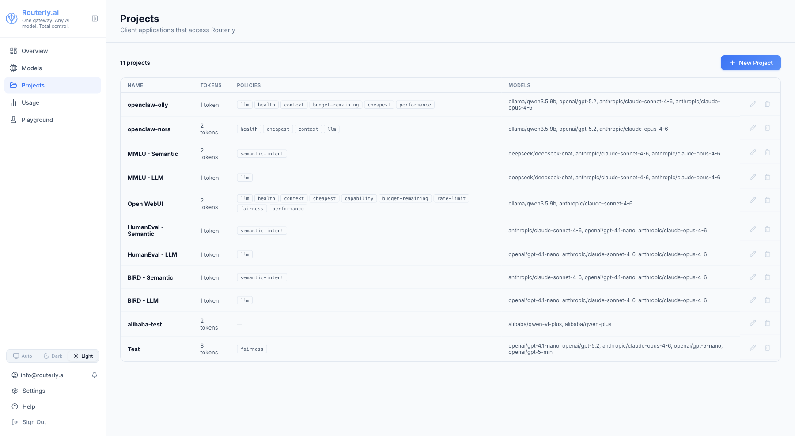
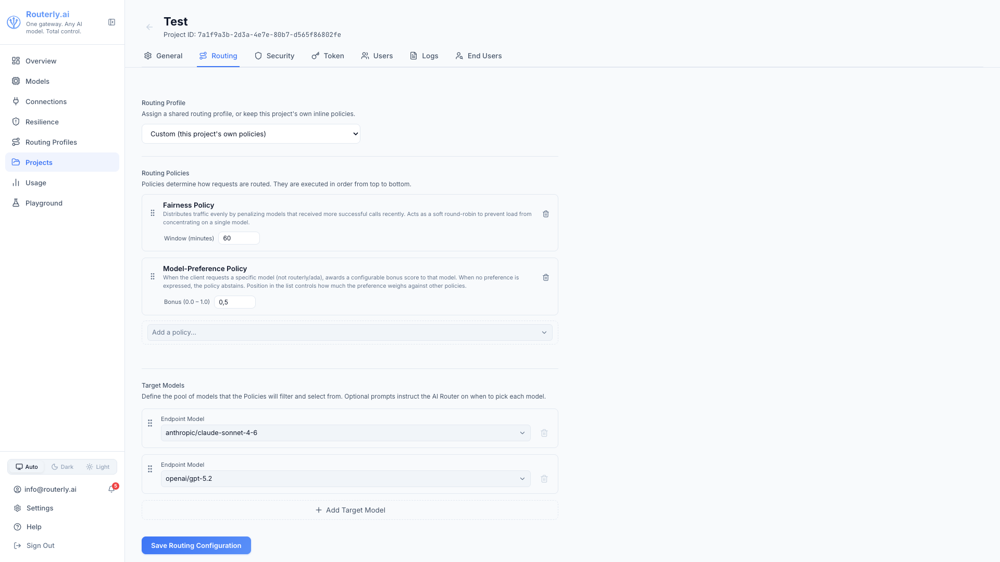

# Dashboard: Projects

The Projects page gives you an overview of all projects and provides access to each project's configuration.

---

## Projects List

The list shows each project's name, slug, number of tokens, assigned models, and a summary of today's cost and call count.

Click any project to open its detail view, which has eight tabs.

---

## General Tab

Shows and lets you edit:

- **Name** — display name for the project
- **Slug** — URL-safe identifier (read-only after creation)
- **Default Timeout** — per-request timeout in milliseconds (overrides the global `defaultTimeoutMs`)
- **Connection Info** — base URL and masked token snippet ready to copy into your SDK configuration
- **Budget** — project-level cost limit (daily / monthly)

---

## Routing Tab

Configure which models this project can use and how to select between them.

### Routing Profile

At the top of the tab, the **Routing Profile** dropdown assigns a shared
[routing profile](./routing-profiles.md) to this project instead of
maintaining inline policies here. Options are `Custom (this project's own
policies)`, followed by the built-in profiles, followed by any custom
profiles.

Selecting a profile **saves immediately** on change, independently from
the **Save Routing Configuration** button below, which only persists this
project's own inline policies and target models. While a profile is assigned,
the inline **Routing Policies** editor is disabled (dimmed, non-interactive):
the project's routing now comes from the profile's policies, selector, and
fallback strategy instead. Switching the dropdown back to **Custom**
re-enables the inline editor and reverts routing to this project's own
policies.

### Adding Models

Use the **+ Add Model** button to pick from registered models. Models appear in a numbered list — their order determines the default routing priority (position 0 is highest).

Drag and drop to reorder.

### Adding Policies

Drag policies from the policy panel on the right into the active-policies list on the left. Each policy can be expanded to configure its parameters.

Available policies: `cheapest`, `health`, `performance`, `capability`, `context`, `llm`, `rate-limit`, `fairness`, `budget-remaining`.

See [Concepts: Routing](../concepts/routing.md) for each policy's behaviour and parameters.

---

## Optimizer Tab

Configure this project's prompt/context optimizer pipeline: a per-project,
ordered list of optimizers that reduce a request's token footprint before it
is forwarded to a provider.

**Required permission:** `optimizers:read` to view the tab; `optimizers:manage` to toggle, reorder, edit thresholds, or save.

### Optimizer Rows

All 7 installed optimizers are listed, one per row, in pipeline execution
order:

- **Checkbox**: enable/disable this optimizer for the project
- **Name and description**: the optimizer's display name, its class
  (`Lossless.` / `Recoverable.` / `Lossy.`), and a one-line summary of its
  behavior
- **Threshold**: optional numeric field, meaning depends on the optimizer
  (a `0`-`1` ratio for `relevance`/`llmlingua-2`, a turn count for `ccr`, a
  token budget for `headroom`; unused for `session-dedup`/`rtk`/`caveman`);
  left empty to use the optimizer's built-in default (where one exists) or
  leave it inert (`relevance` has no default and stays inert until a
  threshold is set)
- **Drag handle**: drag rows to reorder; the pipeline runs top to bottom

Rows for optimizers not yet configured on the project appear disabled at the
end of the list; enabling one and saving adds it to `optimizers.steps`.

See [Concepts: Optimizers](../concepts/optimizers.md) for what each
optimizer does, its class, and known limitations, including the
[Threshold Range](../concepts/optimizers.md#threshold-range) each
optimizer's threshold accepts.

### Saving

Click **Save Optimizers** to persist the enabled/disabled state, order, and
thresholds. A row that is disabled and has no threshold set is not
persisted to `optimizers.steps`. Only enabled rows, or disabled rows with a
threshold, are written.

### Preview Panel

Below the pipeline editor, **Preview token savings** lets you paste a sample
user message and click **Run Preview** to dry-run the current (unsaved) UI
state of the pipeline against it. No upstream call is made and nothing is
saved. The result shows tokens before, tokens after, tokens saved, and a
per-step before/after breakdown, matching `POST /api/optimizers/preview`
(see [API: Optimizers](../api/management.md#optimizers)).

---

## Tokens Tab

Manage Bearer tokens for this project.

### Creating a Token

1. Click **+ New Token**
2. Enter a **Name** (e.g. `production`, `staging`, `ci`)
3. Optionally add **Scopes**: access scopes for this token, e.g. `mcp` and
   `mcp:write` to let the token call Routerly's [MCP server](../concepts/mcp.md).
   Without the `mcp` scope, the token cannot reach `/mcp` at all.
4. Optionally add **Tags** — key-value metadata (e.g., `environment: production`, `team: backend`). Tags are included in every usage record created with this token, enabling filtering and analysis by custom dimensions.
5. Optionally configure per-token limits (metric, limit value, window type, mode)
6. Click **Create**

The token value (`sk-rt-…`) is shown **once**. Copy it immediately.

### Per-Token Limits

Per-token limits let you cap spending for individual applications sharing the same project. The `mode` field controls how the per-token limit interacts with the project-level limit:

| Mode | Behaviour |
|------|-----------|
| `replace` | Per-token limit overrides the project limit for this token |
| `extend` | Both per-token and project limits must pass |
| `disable` | No budget check for this token |

### Rolling or Regenerating a Token

Click the **Re-generate** icon to invalidate the current token and issue a new one. The previous token stops working immediately.

### Editing a Token

Click a token's **Name** to open the edit view. Here you can:

- **Update Scopes**: add or remove access scopes without touching the token value itself.
- **Update Tags** — add, remove, or modify key-value metadata. Changes apply immediately to all future usage records created with this token.
- **Modify Limits** — add or remove spending limits without touching the token value itself.

Any changes to scopes, tags, or limits take effect immediately and do not invalidate the token.

---

## Users Tab

Assign dashboard users to this project. A user assigned here can see and manage the project based on their role's permissions.

Available roles: `viewer`, `editor`, `admin` (or any custom role defined in [Users & Roles](./users-and-roles.md)).

---

## Notifications Tab

Select which notification channels receive events from this project.

**Required permission:** `notification:write` to edit.

### Channel Selection

If **no channels are selected**, all global channels receive events from this project (default behavior).

If **one or more channels are selected**, only those channels receive events from this project. Events are still recorded in the in-app inbox regardless of channel selection.

This provides project-level routing: a single project can funnel its alerts to a dedicated channel (e.g. a project-specific Slack channel or email list) while other projects use the global routing rules.

### Saving Changes

After selecting or deselecting channels, click **Save Changes** to apply. A checkmark appears briefly to confirm the save.

---

## Logs Tab

A live log of recent requests routed through this project.

| Column | Description |
|--------|-------------|
| Timestamp | When the request arrived |
| Model | Provider model that handled the request |
| Status | `success` (green), `blocked` (amber), `error` / `budget_exceeded` etc. (red) |
| Input Tokens | Number of input tokens |
| Output Tokens | Number of output tokens generated |
| Cost | Estimated USD cost |

A `blocked` status means a guardrail rule rejected the request before it reached any model. Zero tokens and zero cost are recorded.

Click any row to open the **Trace view** which shows the full routing decision: which policies ran, which models were considered, and why the final model was chosen.

The table auto-refreshes at a configurable interval. Use the interval selector (5 s / 15 s / 30 s / 1 min / 5 min / Off) to control polling.

---

## End Users Tab

Shows per-end-user activity attributed to this project via the `body.user` field in LLM requests.

**Required permission:** `report:read`

| Column | Description |
|--------|-------------|
| User ID | End-user identifier (from `body.user` in the request) |
| Requests | Total number of requests attributed to this user |
| Tokens | Total tokens used by this user (input + output) |
| Cost | Estimated USD cost for this user's requests |
| First Seen | Timestamp of this user's first request through the project |
| Last Seen | Timestamp of this user's most recent request |

The table is empty when no requests have been made with a `body.user` value.

---

## Security Tab

Configure request filtering and data protection for this project.

**Required permission:** `project:update`

### Content Guardrails

Enable guardrails to evaluate requests and/or responses against an ordered list of independent rules. Each enabled rule is evaluated in sequence.

#### Injection Warning

When one or more rules have the **Inject** flag enabled, an amber warning banner appears above the rule list:

> "One or more rules inject their instruction into the outgoing request's system prompt. The request payload is modified. No extra judge call is made, and nothing is blocked."

This is a soft steering feature (no block, no judge call) and is fully transparent.

#### Rule Cards

Each rule card displays:
- **Type**: rule category (regex, semantic, topic, moderation)
- **Enabled** toggle: when off, this rule is skipped during evaluation
- **Scope flags** (topic/moderation only): three independent checkboxes:
  - **Request**: judge the user messages before they reach the model (hard block + log on trigger)
  - **Inject**: append this rule's instruction to the request system prompt so the model self-enforces (soft steer, no block). For topic rules, injects the allowed-topics description; for moderation, injects the custom instructions (or a built-in default).
  - **Response**: judge the model's response before it reaches the client (hard block + log on trigger)
  - At least one flag must be enabled. Inject-only rules (no Request or Response) skip the judge entirely.
- Scope options (regex/semantic only): Request, Response, or Both (no Inject option)
- Judge configuration fields (topic/moderation only; visible when Request and/or Response is checked):
  - **Judge Model**: dropdown of available judge models (filtered to exclude embedding-only models)
  - **Fallback Models** (optional): multi-select of fallback judge models tried in order if the primary is unavailable or errors
  - **Harm/Topic Threshold**: slider (0-1, default 0.5). For moderation, triggers when score > threshold. For topic, triggers when score < threshold (off-topic).
- Type-specific configuration fields:

| Type | Config |
|------|--------|
| **Regex** | Regex patterns (one per line, case-insensitive) |
| **Semantic** | Embedding model ID, optional fallback embedding models (multi-select, tried in order), example phrases to block, similarity threshold (0-1, default 0.82) |
| **Topic** | Allowed-topics description, score threshold (0-1, default 0.5) |
| **Moderation** | Custom instructions (required): instructions to inject or pass to the judge. Score threshold (0-1, default 0.5). |

##### Judge response (reason-first scoring)

For topic and moderation rules with a judge (Request and/or Response enabled), the judge is asked to respond with a reason first, then a fine-grained score from 0.00 to 10.00. The reason (in the user's language) becomes the block message when the rule triggers. The score is normalized to 0-1 before the threshold check. This anchored rubric prevents bimodal score collapse on small models.

##### Model selection

The model dropdowns are filtered by type:

- **Topic and Moderation** judges: show only non-embedding models (chat/completion models). Embedding-only models cannot act as LLM judges and are excluded.
- **Semantic** embedding field: shows only models with `capabilities.embedding = true`.

##### Fallback models

For topic, moderation, and semantic rules, the "Fallback models (optional, tried in order)" multi-select field allows selecting zero or more fallback models that will be tried in order if the primary model is unavailable or returns an error. If the primary model returns a budget-exceeded error, fallbacks are not tried (fail-closed on budget).

#### Streaming Interaction Notice

When a rule has the **Response** flag enabled (and thus requires buffering the response before the judge verdict), streaming is automatically disabled for the request, and the client receives the full response as a single chunk.

A clear notice box appears on the form when this condition is detected:

> "Responses will be buffered (no streaming) because one or more rules judge the response."

#### Consumer impact

When a judged rule has its Request or Response flag enabled and triggers, the request or response is rejected before reaching the model (or before being sent to the client). Routerly returns HTTP 200 with a wire-faithful content-filter response: `finish_reason: "content_filter"` (OpenAI) or `stop_reason: "refusal"` (Anthropic), with empty content. The block message (from the judge's reason field) is stored on the trace but does not appear in the wire response. API consumers that check `finish_reason`/`stop_reason` will detect the block; those that only read message content will receive an empty reply.

When a rule has only the Inject flag enabled (soft steering), the rule steers the model without calling the judge and does not block or log. The request is forwarded with no consumer-visible impact.

When a rule is skipped (disabled, unavailable model, judge error), the request is forwarded with no consumer-visible impact. The skipped rule is recorded on the usage record for audit purposes.

### PII Scrubbing

Enable PII scrubbing to automatically detect and replace sensitive data in requests before they reach the model, and optionally in responses before they are returned to the caller.

PII configuration uses a list of policies. Click **+ Add policy** to create a new policy. Each policy is displayed as "Policy 1", "Policy 2", etc. (1-based numbering). Each policy has:

- **Enabled** toggle: when off, this policy is skipped
- **Target**: request, response, or both (which side(s) to scrub)
- **Entity types**: checkboxes for EMAIL, PHONE, CREDIT_CARD, SSN, IBAN. All types are selected by default. Uncheck any type to exclude it from scrubbing.
- **Custom patterns**: optional regex patterns in addition to entity detection
- **Streaming buffer size**: (response scrubbing only) suffix buffer size in characters (10-500, default 30). Used to catch patterns spanning chunk boundaries when streaming. Only appears when Target includes response.

All enabled policies with the same direction (request/response) are merged at scrub time. When multiple response policies are active, the largest buffer size is used.

Matched values are replaced with typed placeholders:

| Entity Type | Placeholder | Notes |
|-------------|-------------|-------|
| `EMAIL` | `[EMAIL]` | Email addresses |
| `PHONE` | `[PHONE_NUMBER]` | Phone numbers (US and international formats) |
| `CREDIT_CARD` | `[CREDIT_CARD]` | Card numbers (PAN) |
| `SSN` | `[SSN]` | US Social Security Numbers |
| `IBAN` | `[IBAN]` | International Bank Account Numbers |

#### Consumer impact

PII scrubbing modifies message content before it reaches the model and/or before responses are returned to the caller. Original sensitive values are replaced with typed placeholders. The model receives and responds based on the modified version and cannot reference the original values.

API consumers calling this project's endpoint should be aware that their messages will be modified in-flight. If your application logic requires the model to see exact credit card numbers, email addresses, or phone numbers, disable scrubbing for those entity types. The usage record will include a `piiRedacted` field listing which entity types were detected and scrubbed.

### Saving Security Settings

Click **Save Security Settings** at the bottom of the tab. The button displays a green checkmark on successful save.
