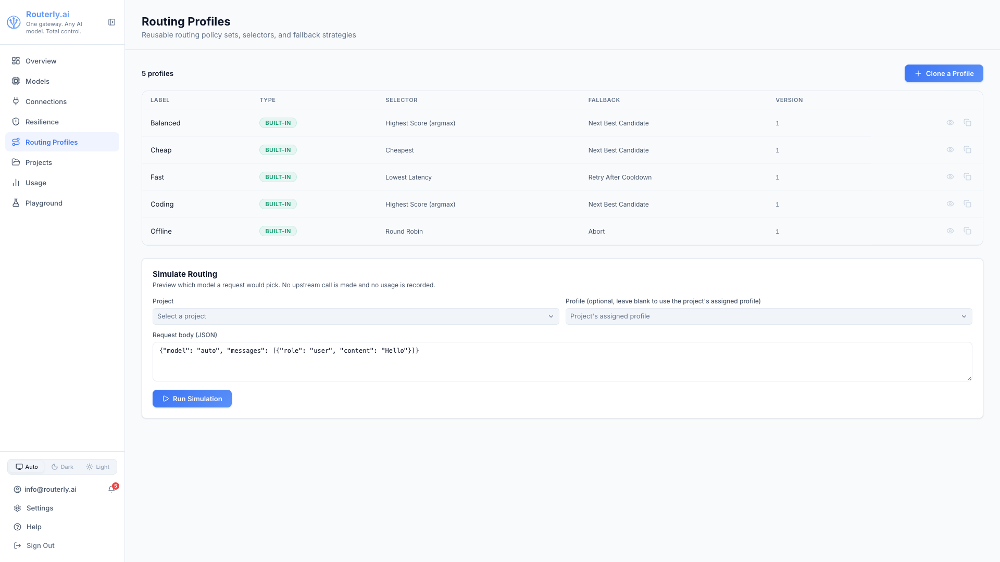

# Dashboard: Routing Profiles

The Routing Profiles page manages reusable routing configurations: a policy
list, a selector, and a fallback strategy bundled into one named profile.
Profiles can be assigned to projects instead of maintaining inline policies
per project, see [Projects: Routing Tab](./projects.md#routing-tab) for the
assignment control.

Navigate to `/dashboard/routing-profiles`.

See [Concepts: Routing](../concepts/routing.md) for each policy's behaviour and parameters.

---

## Profiles List

| Column | Description |
|--------|-------------|
| **Label** | Display name of the profile |
| **Type** | `Built-in` (read-only) or `Custom` (user-cloned, editable) |
| **Selector** | Which selector picks the final model among ranked candidates |
| **Fallback** | Fallback strategy stored on the profile |
| **Version** | Increments by 1 on every edit |

Routerly ships 5 built-in profiles: **Balanced**, **Cheap**, **Fast**,
**Coding**, and **Offline**. Built-in profiles cannot be edited or deleted,
so each row shows a **View** (read-only) button instead of Edit/Delete. Rows
for custom profiles show **Edit** and **Delete** buttons with
`profiles:manage`. Every row also has a **Clone** button with `profiles:manage`.

Without `profiles:read`, the page shows a permission-denied empty state.

---

## Cloning a Profile

1. Click **+ Clone a Profile** (or the **Clone** icon on an existing row, which pre-fills the base profile)
2. Select a **Base profile**: any built-in profile
3. Enter a **Label** for the new profile
4. Click **Clone**

The clone starts as an exact copy of the base profile's policies, selector,
and fallback strategy (`version: 1`, `builtin: false`), and can then be edited
independently.

---

## Editing a Profile

Click **Edit** on a custom profile row to open the inline editor:

- **Label**: rename the profile
- **Selector**: one of `Highest Score (argmax)`, `Weighted Random`,
  `Round Robin`, `Cheapest`, `Lowest Latency`
- **Fallback strategy**: one of `Next Best Candidate`, `Retry After Cooldown`,
  `Abort`
- **Policies**: the same policy set available on a project's Routing tab
  (`health`, `context`, `capability`, `budget-remaining`, `rate-limit`,
  `semantic-intent`, `llm`, `performance`, `fairness`, `cheapest`,
  `model-preference`). Drag to reorder, toggle **Enabled**, remove with the
  trash icon, or add a new one from the **Add a policy...** dropdown at the
  bottom. A policy's advanced `config` (when present) is edited as raw JSON in
  a text area under the policy; invalid JSON blocks saving until fixed.

Click **Save** to persist, or **Cancel** to discard. Built-in profiles open in
the same panel but read-only (**Close** instead of Cancel, all fields
disabled).

---

## Deleting a Profile

Click **Delete** (trash icon) on a custom profile row. A confirmation dialog
warns the action cannot be undone.

Delete can fail with:
- **In use**: a project currently has this profile assigned. Unassign it
  from every project (switch those projects back to Custom, or assign them a
  different profile) before deleting.
- **Built-in**: built-in profiles cannot be deleted at all; the Delete button
  is not shown for them.

---

## Simulate Routing

The **Simulate Routing** panel previews which model a request would pick
without side effects: **no upstream call is made and no usage is recorded.**

1. Select a **Project**, required
2. Optionally select a **Profile** to override the project's assigned profile
   (or its inline policies, if unassigned) for this simulation only
3. Edit the **Request body (JSON)**, defaults to a minimal chat completion
   request
4. Click **Run Simulation**

**Result:**
- **Picked model**: the model the resolved profile's selector chose
- **Ranked table**: every scored candidate with its score and estimated cost
- **Trace**: the same routing trace entries shown on the project Logs tab's
  trace view

---

## Related

- [Concepts: Routing: Routing Profiles](../concepts/routing.md#routing-profiles): what a profile is, built-in profiles, selectors, fallback strategies
- [API: Routing Profiles](../api/management.md#routing-profiles): endpoint reference
- [Dashboard: Projects: Routing Tab](./projects.md#routing-tab): assigning a profile to a project
