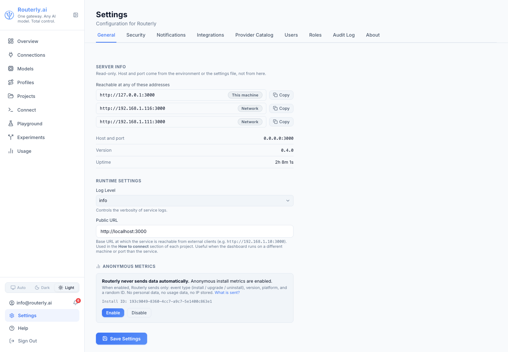
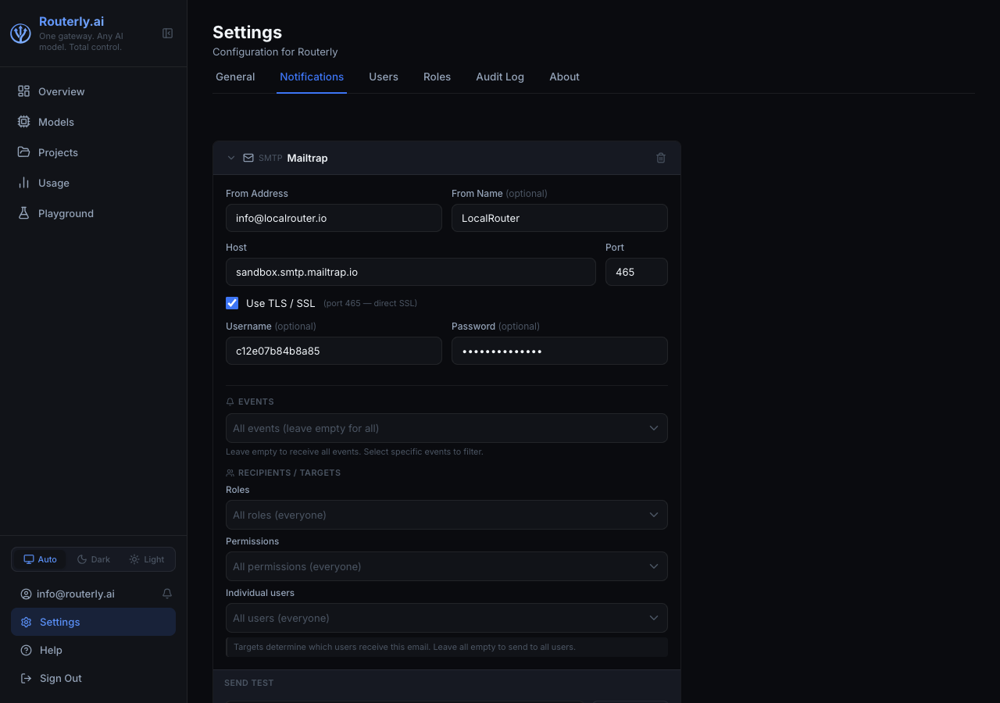
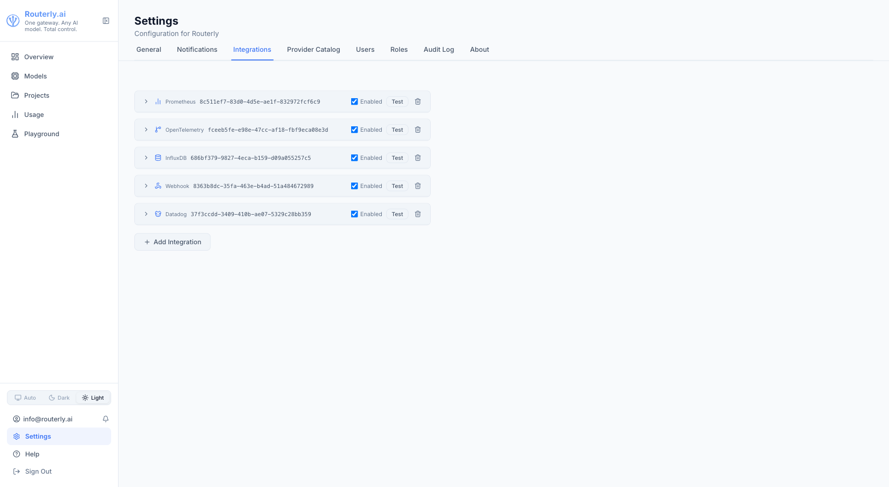

# Dashboard: Settings

The Settings page allows admins to configure the Routerly service, notification channels, and view system information. It is only accessible to users with the `admin` role.

Open Settings from the **Settings** item in the sidebar.

---

## General Tab



### Service Configuration

| Field | Description |
|-------|-------------|
| **Port** | The port the service listens on (read-only — change via CLI or environment variable) |
| **Host** | The bind address (read-only) |
| **Public URL** | The externally accessible URL of this Routerly instance. Shown in project connection snippets |
| **Default Timeout** | Per-request timeout in milliseconds (applies to all projects unless overridden per-project) |
| **Log Level** | `trace` / `debug` / `info` / `warn` / `error` |
| **Dashboard Enabled** | Toggle the web dashboard on or off |

Changes are saved immediately and take effect without a restart (except Port and Host, which require a restart).

---

## Notifications Tab {#notifications-tab}



Configure notification channels. Each channel routes events to a delivery method (in-app inbox, email, or webhook) and can be scoped to specific event types and recipients.

The Notifications tab provides a **channel management interface** with a full list of configured channels and options to create, edit, test, and delete them.

### Channel List

The list displays all configured channels in a table with:
- **Name** - friendly label
- **Type** - channel provider (Dashboard, SMTP, Slack, etc.)
- **Events** - event filter summary (shows first few patterns, `*` = all)
- **Targets** - target summary (role, permission, and user counts; empty = everyone)
- **Actions** - buttons to edit, test, and delete

Click a channel row to navigate to its **edit page** for detailed configuration.

### Adding a Channel

1. Click **+ Add Channel** (or navigate to **Settings > Notifications > New Channel**)
2. Select the channel type: `Dashboard`, `SMTP`, `SES`, `SendGrid`, `Azure`, `Google`, `Webhook`, `Slack`, `Teams`, `PagerDuty`, or `Discord`
3. Fill in the friendly **Name** and any required connection details:
   - **Dashboard**: name only (no credentials)
   - **Email providers** (SMTP, SES, SendGrid, Azure, Google): host, auth, from address
   - **Webhooks/Native** (Webhook, Slack, Teams, PagerDuty, Discord): integration URLs and keys
4. (Optional) Filter by **Events** - select specific event types to route to this channel; leave empty to receive all
5. (Optional) Set **Recipients / Targets** - pick roles, permissions, or individual users; leave empty for everyone
6. Click **Create Channel**
7. Use **Send Test** to verify the channel works before relying on it for real events

See [Concepts: Notifications](../concepts/notifications.md) for the full event taxonomy and per-type configuration fields.

:::note Target scope
**Recipients / Targets** control inbox visibility for the `Dashboard` channel and recipient resolution for email channels. Webhook and native channels (Slack, Teams, PagerDuty, Discord) deliver to a fixed endpoint - targets are stored but do not affect their delivery.
:::

### Editing a Channel

Click the channel row or the **Edit** button to open the edit page. You can change:
- **Name** - friendly label
- **Events** - event filter (leave empty for all)
- **Recipients / Targets** - audience filter
- **Connection details** - provider-specific fields (host, API keys, etc.). Secret fields (passwords, API keys, tokens) show as masked (`***`) when present; clearing the field will leave it unchanged. To update a secret, re-enter it in the text field.

After making changes, click **Update Channel** to save.

### Testing a Channel

On the channel list or edit page, click **Send Test**. Routerly sends a test message immediately. Check for a success toast or an error message with details about what went wrong.

For email-provider channels, you can optionally override the recipient email address before sending the test.

### Removing a Channel

Click the **Delete** button on the channel row or edit page. You will be asked to confirm deletion.

### Routing Rules

Routing rules map event patterns to one or more channels. When an event matches a rule's patterns, it is dispatched to the specified channels (in addition to any project-level overrides via the Notifications tab on the project page).

By default, events are not routed to any channels — they are only recorded in the inbox. Add a rule to enable routing.

**Adding a Rule:**

1. Scroll to the **Routing Rules** section
2. Click **+ Add Rule**
3. Select one or more **Events** from the dropdown (e.g. `Provider - Error`, `Budget - Threshold`)
4. Select one or more **Channels** to route matching events to
5. Click **Add**

The rule is applied immediately.

**Event Patterns:**

Rules support three pattern types:
- **Exact name** — e.g. `provider.error` (matches only that event)
- **Wildcard** — `*` (matches all events)
- **Prefix glob** — e.g. `budget.*` (matches `budget.threshold`, `budget.exhausted`, etc.)

**Removing a Rule:**

Click the **×** icon next to a rule to delete it.

See [Concepts: Notifications — Routing Rules](../concepts/notifications.md#routing-rules) for additional details.

### Cooldowns

Cooldowns suppress repeated dispatches of the same event type within a specified interval. Suppressed events are still recorded in the inbox and logs; they are simply not sent to external channels.

This prevents alert fatigue when a system is repeatedly triggering the same issue.

**Adding a Cooldown:**

1. Scroll to the **Cooldowns** section
2. Click **+ Add Cooldown**
3. Select an **Event** from the dropdown (e.g. `Provider - Degraded`)
4. Enter a **Duration** in format: `15m`, `1h`, `30s`, `2d` (supports `s` / `m` / `h` / `d` suffixes)
5. Click **Add**

The cooldown is applied immediately.

**Removing a Cooldown:**

Click the **×** icon next to a cooldown to delete it.

See [Concepts: Notifications — Cooldowns](../concepts/notifications.md#cooldowns) for additional details.

---

## Provider Catalog Tab {#catalog-tab}

Configure the provider and model catalog repositories. Routerly fetches the catalog dynamically from one or more remote repositories at runtime, enabling rapid updates without service restarts.

The default catalog source is the official Inebrio repository. Add custom repositories to merge additional providers or override defaults.

### Repository List

The table displays all configured repositories with the following columns:

- **#** — Priority (row order). Row 1 is checked first on merge conflict. Use arrow buttons to reorder.
- **URL** — Repository endpoint (clickable, opens in new tab)
- **File** — Filename of the last resolved catalog snapshot (or `—` if never fetched)
- **Updated** — Timestamp from the catalog registry, indicating when the snapshot was created (or `—`)
- **Last Check** — When Routerly last attempted to fetch from this repo (or `—` if never checked)
- **Status** — `Active` (green) for enabled repos, `Disabled` (muted) for disabled repos, or `Error` (red with tooltip showing details)

### Reordering Repositories

Click the up/down arrow buttons on each row to change priority. The first repo in the list wins on merge conflict. Up arrow is disabled on row 1 (topmost); down arrow is disabled on the last row.

### Editing a Repository

Click **Edit** to modify:
- **URL** — the repository endpoint (required)
- **Enabled** — checkbox to enable or disable the repo without removing it

Click **Save** to persist changes or **Cancel** to discard.

### Removing a Repository

Click the **Remove** (trash icon) button to delete a repository from the list immediately. The default Inebrio repository cannot be removed.

### Adding a Repository

1. Scroll to the **Add Repository** form below the table
2. Enter the repository **URL** (e.g. `https://your-org.com/catalog/`)
3. Click **Add Repository**

The new repo is appended at the end of the list (lowest priority). Enable/disable or reorder as needed.

### Refresh

Click the **Refresh** button in the top right to invalidate the 6-hour in-memory cache and fetch all enabled repositories immediately. The estimated next automatic refresh time is shown below the button. Useful after adding a new repo or when you know the catalog has been updated.

---

## Modules Tab {#modules-tab}

Manage optional service modules. Routerly's core infrastructure (routing, reverse proxy, provider adapters) cannot be disabled, but optional modules like `guardrails` and `pii` can be toggled on or off to reduce memory overhead or disable unused features entirely at boot.

### Module List

The list displays all available modules in a table with the following columns:

- **Module** — module identifier
- **Version** — semantic version
- **Depends on** — comma-separated list of module IDs this module requires; `-` if no dependencies
- **State** — `Enabled` or `Disabled`
- **Action** — `Enable` / `Disable` button (grayed out and labeled "Locked" for always-on core modules)

### Enabling and Disabling Modules

Click the **Enable** or **Disable** button to toggle a module. The button becomes disabled while the request is in flight (`...`).

After a successful toggle, a yellow alert banner appears at the top:

```
Module changes require a service restart to take effect. Restart the Routerly service
(for Docker: docker restart <container>; otherwise stop and re-run the service process).
```

**Core modules** (always-on) show a "Locked" label instead of an action button. They cannot be disabled.

### Supported Modules

| Module | ID | Always-on | Purpose |
|--------|-----|-----------|---------|
| Reverse Proxy | `reverse-proxy` | yes | Core request routing engine |
| Provider | `provider` | yes | Model provider adapters |
| Routing | `routing` | yes | Routing policy evaluation |
| Config | `config` | yes | Configuration management |
| Catalog | `catalog` | yes | Provider and model catalog |
| Guardrails | `guardrails` | no | Content security rules (regex, semantic, topic, moderation, PII scrubbing) |

### Dependency Handling

A module cannot be disabled if other enabled modules depend on it. For example, disabling the `provider` module fails with the error:

```
Cannot disable "provider": required by reverse-proxy, routing
```

Similarly, enabling a module fails if its dependencies are disabled:

```
Cannot enable "guardrails": depends on disabled provider
```

Resolve dependency conflicts by enabling the required module(s) first, or by disabling the dependent module(s).

### Error States

- **Load failure** — if the module list fails to load, a red error message appears: `Failed to load modules: <error message>`
- **Toggle failure** — if an enable/disable request fails (e.g. permission denied, dependency conflict), an error message appears below the table and the module state is reloaded to reflect the actual state on the server

### Access Control

Viewing the list requires `modules:read` (held by `viewer`, `operator`, and `admin` by default). Enabling/disabling requires `modules:manage` (`admin` only by default). The tab itself is always visible; a user lacking `modules:read` sees the load-failure error state instead of the module list.

---

## Integrations Tab {#integrations-tab}

Export Routerly metrics to external monitoring and observability systems. Integrations push metrics every 60 seconds to your chosen platform.

Supports: **Prometheus** (pull), **OpenTelemetry**, **Datadog**, **Grafana Cloud**, **InfluxDB**, and **Webhook**.

The Integrations tab provides a **management interface** with a list of configured integrations and options to create, edit, test, enable/disable, and delete them.

### Integration List

The list displays all configured integrations in a table with:
- **Name** — friendly label
- **Type** — integration provider (Prometheus, Datadog, OpenTelemetry, etc.)
- **Status** — enabled/disabled toggle
- **Details** — endpoint, URL, or key identifier (truncated for readability)
- **Actions** — buttons to edit, test, and delete

Click a row to expand inline details (endpoint, protocol, headers, etc. depending on type).



### Adding an Integration

1. Click **+ Add Integration** to open the create form
2. Select the integration **Type**: `Prometheus`, `OpenTelemetry`, `Datadog`, `Grafana Cloud`, `InfluxDB`, or `Webhook`
3. Enter a friendly **Name** (e.g. "Production Datadog")
4. Fill in **type-specific configuration**:

   **Prometheus** (pull-based, no push):
   - **Auth Token** (optional) — if Routerly's `/metrics` endpoint requires bearer authentication

   **OpenTelemetry** (push):
   - **Endpoint URL** (required) — e.g. `http://localhost:4318/v1/metrics`
   - **Protocol** (required) — `http` or `grpc`
   - **Headers** (optional) — one per line, format `Key: Value` (e.g. `Authorization: Bearer token`)

   **Datadog** (push):
   - **API Key** (required) — your Datadog API key
   - **Site** (required) — `datadoghq.com` (US East), `datadoghq.eu` (EU), `us3.datadoghq.com`, `us5.datadoghq.com`, or `ddog-gov.com`

   **Grafana Cloud** (push):
   - **Remote Write URL** (required) — Prometheus remote_write endpoint from your Grafana Cloud instance
   - **Username** (required) — numeric ID from Grafana Cloud
   - **API Key** (required) — your Grafana Cloud API key

   **InfluxDB** (push):
   - **URL** (required) — e.g. `http://localhost:8086`
   - **Token** (required) — InfluxDB API token
   - **Organization** (required) — org name in InfluxDB
   - **Bucket** (required) — target bucket for metrics

   **Webhook** (push):
   - **URL** (required) — HTTPS endpoint to receive metric POST requests
   - **Secret** (optional) — if set, Routerly signs each request with HMAC-SHA256 in the `X-Routerly-Signature` header
   - **Headers** (optional) — custom headers to include with each request

5. Check the **Enabled** toggle to activate immediately upon creation
6. Click **Create Integration**
7. Use **Test** to verify connectivity before relying on it for production metrics

### Editing an Integration

Click the **Edit** button on an integration row to open the edit page. You can change:
- **Name** — friendly label
- **Enabled** toggle — pause/resume without deleting
- **Type-specific config** — provider credentials and settings. Secret fields (API keys, tokens, auth token, secret) show as masked (`***`) when present; clearing the field will leave it unchanged. To update a secret, re-enter it in the text field.

After making changes, click **Update Integration** to save.

### Testing an Integration

On the list or edit page, click **Test**. Routerly verifies connectivity to the external system and sends a test request if applicable.

- **Prometheus** — test is a no-op (always succeeds; Prometheus pulls metrics from `/metrics`, so outbound connectivity is not checked)
- **Push types** — sends a real metrics payload and returns success or error details

A toast notification shows the result immediately.

### Enabling and Disabling

Use the **Enabled** toggle on the list view to pause metric export to an integration without deleting it. Disabled integrations do not receive metric pushes.

### Removing an Integration

Click the **Delete** button on a row. You will be asked to confirm deletion.

### Metrics Exported

All push-type integrations (OpenTelemetry, Datadog, Grafana, InfluxDB, Webhook) receive the same metrics every 60 seconds:

| Metric | Type | Dimensions | Description |
|--------|------|-----------|-------------|
| `routerly_requests_total` | Counter | project, model | Total request count by project and model |
| `routerly_tokens_total` | Counter | type (input/output), project, model | Total tokens consumed |
| `routerly_cost_usd_total` | Gauge | project, model | Estimated USD cost by project and model |
| `routerly_request_duration_p50_ms` | Gauge | project | Median request latency per project |
| `routerly_request_duration_p95_ms` | Gauge | project | 95th percentile latency per project |
| `routerly_budget_used_ratio` | Gauge | project | Budget consumption ratio (0–1) per project |

Each platform receives metrics in its native format:
- **OpenTelemetry** — OTLP JSON or gRPC
- **Datadog** — Datadog Series API v2
- **Grafana** — Prometheus remote_write format
- **InfluxDB** — InfluxDB v2 line protocol
- **Webhook** — JSON POST with metric snapshot

---

## About Tab

### Application

System information about the running instance:

| Field | Description |
|-------|-------------|
| **Version** | Routerly version string |
| **Channel** | Active update channel: `latest`, `stable`, `develop`, or a pinned version tag. Editable — see [Update Channel](#update-channel) below |
| **Uptime** | How long the service has been running since last start |
| **Node.js** | Node.js runtime version |
| **Platform** | OS and architecture |
| **Config Directory** | Path to `~/.routerly/config/` (or `$ROUTERLY_HOME/config/`) |

### Update Channel

The channel selector lets you choose which release stream Routerly follows when checking for updates:

| Channel | Description |
|---------|-------------|
| `latest` | Most recent release (may include pre-releases) |
| `stable` | Most recent production-stable release |
| `develop` | Development pre-release builds |
| Custom version | Pin to a specific release tag (e.g. `v0.2.0`) |

Changing the channel takes effect immediately — the running service is notified without a restart.

To enter a specific version tag, select **Custom…** in the dropdown. Type the tag (e.g. `v0.2.0`) and click **Apply**.

You can also change the channel from the CLI:

```bash
routerly update channel stable
routerly update channel v0.2.0
```

### Software Update

Shows the current update status for the active channel. The service checks for new releases automatically every 24 hours.

| Field | Description |
|-------|-------------|
| **Current version** | The version currently running |
| **Available version** | The latest version on the active channel, or "Up to date" if already current |
| **Last checked** | Timestamp of the most recent check against the GitHub Releases API |

**Check for updates** forces an immediate check against the GitHub Releases API and refreshes the displayed result.

**Update to vX.Y.Z** — visible only when a newer version is available on the current channel and the service is not running inside Docker. Clicking it triggers an in-app update:

1. The service downloads and runs the installer for the new version in the background
2. The service restarts automatically
3. The dashboard reloads once the service is back online (polled every 3 seconds, up to 60 seconds)

:::note Docker deployments
In-app update is disabled when Routerly is running inside a Docker container. Pull the new image and recreate the container instead:
```bash
docker pull inebrio/routerly:latest
docker compose up -d
```
:::

### Admin Update Banner

When a newer version is available on the active channel, a yellow banner appears at the top of every page for admin users. The banner links to this page and can be dismissed for the current browser session by clicking **×**.

---

## Audit Log

**Settings → Audit Log**

The Audit Log records every write operation performed on the Routerly instance: who did what, when, and whether it succeeded or was blocked.

### What is recorded

| Event | Trigger |
|-------|---------|
| `model:create/update/delete` | Model added, edited, or removed |
| `project:create/update/delete` | Project added, edited, or removed |
| `user:create/update/delete` | User added, edited, or removed |
| `role:create/update/delete` | Role added, edited, or removed |
| `token:create/delete` | API token issued or revoked |
| `settings:update` | Global settings changed |
| `forbidden` | Any action blocked by missing permission |

### Filters

- **Period** — date range picker with presets (today, last 7 days, this month, etc.)
- **User** — filter by email or user ID
- **Action** — filter by action substring (e.g. `model:create`)
- **Result** — toggle between All / Success / Forbidden / Error

Results are paginated (50 entries per page), server-side.

### Retention

Entries older than 90 days are automatically pruned. Maximum 10,000 entries are kept at any time.

### Access control

Requires `audit:read` permission. Assign this permission to roles that should have read-only access to the audit trail (e.g. a dedicated "Auditor" role).
