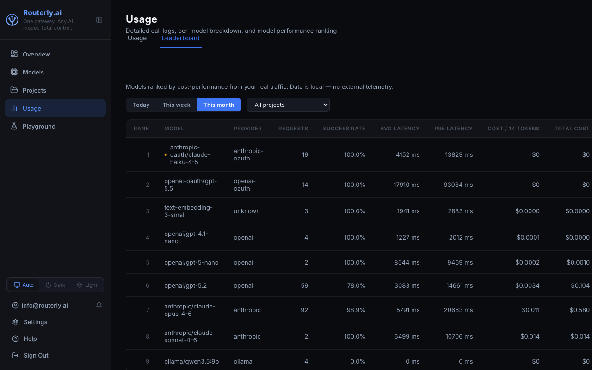

# Dashboard: Usage

The Usage page provides aggregate analytics and per-request logs across all projects. Use it to understand spending patterns, investigate errors, and drill into individual request traces.

The page has two tabs: **Usage** (call logs and statistics) and **Leaderboard** (model performance ranking).

---

## Usage Tab

### Summary Statistics

The top row shows aggregated totals for the selected filter set:


| Card | Description |
|------|-------------|
| **Total Cost** | USD cost of all successful calls in the period |
| **Total Calls** | All usage records (completion + routing + guardrail) |
| **Completion Calls** | Main model inference calls, with their total cost |
| **Router Calls** | LLM routing policy calls (e.g. the `llm` routing policy), with cost |
| **Guardrail Calls** | Model calls made by security rules (semantic, topic, moderation), with cost |
| **Errors** | Failed calls (any call type) |

Guardrail calls are charged to the project like any other model call and are subject to the project's budget limits.

### Filters

| Filter | Description |
|--------|-------------|
| **Period** | Preset time window (today, this month, etc.) or custom range |
| **Project** | Filter to a specific project |
| **Model** | Filter to specific model IDs |
| **Type** | `All`, `Completion`, `Router`, or `Guardrail` — filters by call sub-activity type |
| **Status** | `All`, `Success`, or `Error` |

Filters are applied immediately; the page updates in real time.

### Usage Table

The table lists individual requests with:

| Column | Description |
|--------|-------------|
| Timestamp | When the request arrived |
| Project | The project the request belonged to |
| Model | Provider model used |
| Type | API type (`chat`, `responses`, `messages`) |
| Status | Outcome |
| Input Tokens | Input token count |
| Output Tokens | Output token count |
| Cost | Estimated cost in USD |
| Latency | Time to first byte / total response time |

Click any row to open the full **Trace view**.

### Trace View

The trace view shows the complete lifecycle of a single request:

1. **Router Request** — the routing engine's input: the project slug, requested model (if any), and active policies
2. **Router Response** — which model was selected and why (policy scores listed)
3. **Model Request** — the actual payload sent to the provider
4. **Model Response** — the raw provider response including all tokens and finish reason

The trace also includes guardrail (`guardrail:triggered`, `guardrail:response-triggered`) and PII scrubbing (`pii:scrubbed`) entries when those features are active. For blocked requests, the trace shows the `fallbackMessage` that was stored but not sent on the wire.

### Live Polling

The usage table auto-refreshes to show new requests as they arrive. Use the interval selector in the top-right:

| Interval | Meaning |
|----------|---------|
| 5 s | Refresh every 5 seconds |
| 15 s | Refresh every 15 seconds |
| 30 s | Refresh every 30 seconds |
| 1 min | Refresh every minute |
| 5 min | Refresh every 5 minutes |
| Now | Manual refresh only |

---

## Leaderboard Tab



The Leaderboard ranks all models by cost-performance ratio based on your own traffic. Data is computed locally — no external telemetry.

| Column | Description |
|--------|-------------|
| **Rank** | Performance rank (1 = best cost-performance) |
| **Model** | Provider model identifier |
| **Provider** | Provider name |
| **Requests** | Total requests in the period |
| **Success Rate** | Percentage of successful completions |
| **Avg Latency** | Mean response time |
| **P95 Latency** | 95th-percentile response time |
| **Cost / 1K Tokens** | Effective blended cost per 1,000 tokens |
| **Total Cost** | Total spend for this model in the period |

Filter by **period** (Today, This week, This month) and **project** using the controls above the table.

:::note Redirected from /dashboard/leaderboard
The standalone Leaderboard page has moved. `/dashboard/leaderboard` now redirects to `/dashboard/usage?tab=leaderboard`.
:::

---

## Exporting Usage Data

Usage data is stored in `~/.routerly/data/usage.json` as newline-delimited JSON. You can process it with any standard tool:

```bash
# Total cost this month
cat ~/.routerly/data/usage.json | \
  jq -r 'select(.timestamp | startswith("2025-07")) | .cost' | \
  awk '{sum+=$1} END {printf "Total: $%.4f\n", sum}'
```

For programmatic access, use the [Usage API](../api/management.md#usage).
