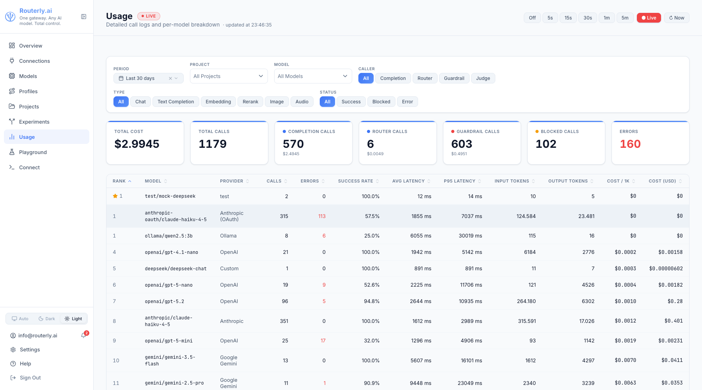

# Dashboard: Usage

The Usage page provides aggregate analytics, per-model performance breakdown, and per-request logs across all projects. Use it to understand spending patterns, investigate errors, and drill into individual request traces.

---

## Summary Statistics

The top row shows aggregated totals for the selected filter set:



| Card | Description |
|------|-------------|
| **Total Cost** | USD cost of all successful calls in the period |
| **Total Calls** | All usage records (completion + routing + guardrail + blocked) |
| **Completion Calls** | Main model inference calls, with their total cost |
| **Router Calls** | LLM routing policy calls (e.g. the `llm` routing policy), with cost |
| **Guardrail Calls** | Model calls made by security rules (semantic, topic, moderation), with cost |
| **Blocked Calls** | Requests blocked by a guardrail rule before reaching any model. Shown only when at least one blocked call exists in the period. |
| **Errors** | Failed model calls -- blocked calls are counted separately and excluded from this number |

Guardrail judge calls are charged to the project like any other model call and are subject to the project's budget limits. Blocked requests record zero cost and zero tokens.

---

## Filters

| Filter | Description |
|--------|-------------|
| **Period** | Preset time window (today, this month, etc.) or custom range |
| **Project** | Filter to a specific project |
| **Model** | Filter to specific model IDs |
| **Type** | `All`, `Completion`, `Router`, or `Guardrail` -- filters by call sub-activity type |
| **Status** | `All`, `Success`, `Blocked`, or `Error` -- `Blocked` shows only guardrail-blocked requests |
| **Session ID** | Filter to requests from a specific session (from the `x-routerly-conversation-id` header) |
| **Tags** | Filter by token metadata (e.g., `environment: production`) |

Filters are applied immediately and affect the summary cards, the per-model breakdown table, and the request log simultaneously.

:::tip Session tracking and custom metadata
Use the **Session ID** filter to view all requests from a specific conversation or user session. Use the **Tags** filter to analyze traffic by team, environment, application, or any custom dimension you tag your tokens with.
:::

---

## Per-Model Breakdown

Below the summary cards, a table ranks all models that received traffic in the selected period.

| Column | Description |
|--------|-------------|
| **Model** | Provider model identifier |
| **Provider** | Provider name |
| **Calls** | Total requests in the period |
| **Errors** | Failed calls |
| **Success Rate** | Percentage of successful completions |
| **Avg Latency** | Mean response time |
| **P95 Latency** | 95th-percentile response time |
| **Input Tokens** | Total input tokens consumed |
| **Output Tokens** | Total output tokens produced |
| **Last Used** | Timestamp of the most recent call |
| **Total Cost** | Total spend for this model in the period |

A star marks the model with the best cost-performance ratio based on your own traffic. The table respects all active filters.

:::note Redirected from /dashboard/leaderboard
The standalone Leaderboard page has been merged into this page. `/dashboard/leaderboard` redirects to `/dashboard/usage`.
:::

---

## Usage Table

The table lists individual requests with:

| Column | Description |
|--------|-------------|
| Timestamp | When the request arrived |
| Project | The project the request belonged to |
| Model | Provider model used |
| Type | API type (`chat`, `responses`, `messages`) |
| Status | Outcome |
| Input Tokens | Input token count |
| Output Tokens | Output token count |
| Cost | Estimated cost in USD |
| Latency | Time to first byte / total response time |

The **Status** badge in the table uses colour coding:

| Outcome | Badge colour |
|---------|-------------|
| `success` | Green |
| `blocked` | Amber |
| `error` / other | Red |

Click any row to open the full **Trace view**.

### Trace View

The trace view shows the complete lifecycle of a single request:

1. **Router Request** -- the routing engine's input: the project slug, requested model (if any), and active policies
2. **Router Response** -- which model was selected and why (policy scores listed)
3. **Model Request** -- the actual payload sent to the provider
4. **Model Response** -- the raw provider response including all tokens and finish reason

The trace also includes guardrail and PII entries when those features are active:

| Trace entry | When |
|-------------|------|
| `guardrail:evaluated` | After every guardrail check -- shows each rule's `outcome` (`passed`, `triggered`, or `skipped`) and `reason`, even when no rule fires |
| `guardrail:triggered` | A request-side rule matched (action `flag`/`log`; request continued) |
| `guardrail:response-triggered` | A response-side rule matched |
| `pii:scrubbed` | PII was detected and replaced in the request or response |

For a **blocked** request (`action: block`), the trace includes the `guardrail:evaluated` entry and the `fallbackMessage`. The fallback message is stored on the trace only -- it is not included in the wire response sent to the client.

The **detail panel** for each usage record shows:

| Field | Description |
|-------|-------------|
| **Guardrail Triggered** | Identifier of the first rule that fired (e.g. `regex:pattern`, `injection:dan-mode`, `topic:gpt-4o-mini`) |
| **Blocked By** | Same as Guardrail Triggered -- present only when `outcome` is `blocked` |
| **PII Redacted** | Comma-separated list of entity types redacted (e.g. `EMAIL, PHONE`) |
| **Session ID** | Session identifier from the `x-routerly-conversation-id` header, if provided (useful for grouping multi-turn conversations or user sessions) |
| **Tags** | Custom metadata from the token that made the request (e.g., `environment: production`, `team: backend`); enables filtering and analysis by custom dimensions |

### Live Polling

The usage table auto-refreshes to show new requests as they arrive. Use the interval selector in the top-right:

| Interval | Meaning |
|----------|---------|
| 5 s | Refresh every 5 seconds |
| 15 s | Refresh every 15 seconds |
| 30 s | Refresh every 30 seconds |
| 1 min | Refresh every minute |
| 5 min | Refresh every 5 minutes |
| Now | Manual refresh only |

---

## Exporting Usage Data

Usage data is stored in `~/.routerly/data/usage.json` as newline-delimited JSON. You can process it with any standard tool:

```bash
# Total cost this month
cat ~/.routerly/data/usage.json | \
  jq -r 'select(.timestamp | startswith("2025-07")) | .cost' | \
  awk '{sum+=$1} END {printf "Total: $%.4f\n", sum}'
```

For programmatic access, use the [Usage API](../api/management.md#usage).
