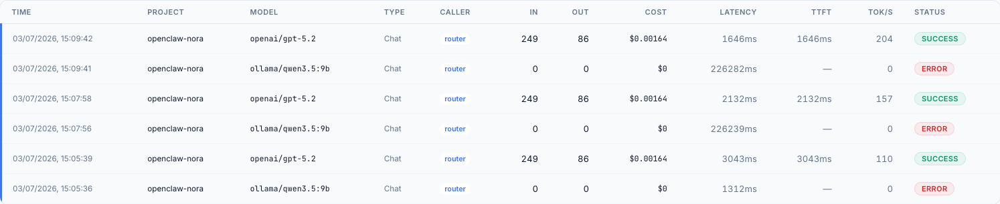

# Dashboard: Usage

The Usage page provides aggregate analytics, per-model performance breakdown, and per-request logs across all projects. Use it to understand spending patterns, investigate errors, and drill into individual request traces.

---

## Summary Statistics

The top row shows aggregated totals for the selected filter set:


| Card | Description |
|------|-------------|
| **Total Cost** | USD cost of all successful calls in the period |
| **Total Calls** | All usage records (completion + routing + guardrail + blocked) |
| **Completion Calls** | Main model inference calls, with their total cost |
| **Router Calls** | Model calls the router makes to decide where to route: the `llm` policy's decision call and the `semantic-intent` policy's embedding call, with their cost |
| **Guardrail Calls** | Model calls made by security rules (semantic, topic, moderation), with cost |
| **Blocked Calls** | Requests blocked by a guardrail rule before reaching any model. Shown only when at least one blocked call exists in the period. |
| **Errors** | Failed model calls -- blocked calls are counted separately and excluded from this number |

The **Completion Calls** and **Router Calls** cards double as filters: clicking
one sets the Caller filter to that kind and outlines the card, clicking it again
clears the filter.

Guardrail judge calls are charged to the project like any other model call and are subject to the project's budget limits. Blocked requests record zero cost and zero tokens.

---

## Filters

| Filter | Description |
|--------|-------------|
| **Period** | Preset time window (today, this month, etc.) or custom range |
| **Project** | Filter to a specific project |
| **Model** | Filter to specific model IDs |
| **Caller** | `All`, `Completion`, `Router`, `Guardrail`, or `Judge` -- who made the call: the client, the router, the guardrail pipeline, or an experiment judge |
| **Type** | `All`, `Chat`, `Text Completion`, `Embedding`, `Rerank`, `Image`, or `Audio` -- what the call asked for, taken from the endpoint the client hit |
| **Status** | `All`, `Success`, `Blocked`, or `Error` -- `Blocked` shows only guardrail-blocked requests |
| **Session ID** | Filter to requests from a specific session (from the `x-routerly-conversation-id` header) |
| **Tags** | Filter by token metadata (e.g., `environment: production`) |

Filters are applied immediately and affect the summary cards, the per-model breakdown table, and the request log simultaneously.

:::tip Session tracking and custom metadata
Use the **Session ID** filter to view all requests from a specific conversation or user session. Use the **Tags** filter to analyze traffic by team, environment, application, or any custom dimension you tag your tokens with.
:::

---

## Per-Model Breakdown

Below the summary cards, a table ranks all models that received traffic in the selected period.

| Column | Description |
|--------|-------------|
| **Rank** | Position in the cost-performance ranking; a model with no ranking data shows a dash and always sorts last |
| **Model** | Provider model identifier |
| **Provider** | Provider name |
| **Calls** | Total requests in the period |
| **Errors** | Failed calls |
| **Success Rate** | Percentage of successful completions |
| **Avg Latency** | Mean response time |
| **P95 Latency** | 95th-percentile response time |
| **Input Tokens** | Total input tokens consumed |
| **Output Tokens** | Total output tokens produced |
| **Cost / 1K** | Average cost per 1,000 tokens |
| **Cost (USD)** | Total spend for this model in the period |

A star marks the model with the best cost-performance ratio based on your own
traffic. Every column header sorts. The table respects all active filters.

:::note Redirected from /dashboard/leaderboard
The standalone Leaderboard page has been merged into this page. `/dashboard/leaderboard` redirects to `/dashboard/usage`.
:::

---

## Usage Table

**Recent Calls** lists individual requests, newest first. The heading counts how
many records the active filters kept out of the period's total.

| Column | Description |
|--------|-------------|
| Time | When the request arrived |
| Project | The project the request belonged to |
| Model | Provider model used |
| Type | What the call asked for: `Chat`, `Text Completion`, `Embedding`, `Rerank`, `Image`, `Audio` |
| Caller | Who made the call: `completion` (the client), `router`, `guardrail`, or `judge` |
| In / Out | Input and output token counts |
| Cost | Estimated cost in USD, to three significant digits; anything below a millionth of a dollar shows as `<$0.000001` |
| Latency | Total response time |
| TTFT | Time to first token, for streamed responses |
| Tok/s | Output tokens per second |
| Status | Outcome |

Every numeric column is right-aligned and uses tabular figures, so the digits
line up down the column.

A call Routerly made on its own behalf (`router`, `guardrail`, `judge`) is
marked twice: its Caller cell is a coloured badge, and the whole row carries a
matching coloured bar on the left edge. Client completions, which are the bulk
of the rows, stay unmarked.



The **Status** badge in the table uses colour coding:

| Outcome | Badge colour |
|---------|-------------|
| `success` | Green |
| `blocked` | Amber |
| `error` / other | Red |

Click any row to open the full **Trace view**.

### Trace View

The trace view shows the complete lifecycle of a single request:

1. **Router Request** -- the routing engine's input: the project, requested model (if any), and active policies
2. **Router Response** -- which model was selected and why (policy scores listed)
3. **Model Request** -- the actual payload sent to the provider
4. **Model Response** -- the raw provider response including all tokens and finish reason

The trace also includes guardrail and PII entries when those features are active:

| Trace entry | When |
|-------------|------|
| `guardrail:evaluated` | After every guardrail check -- shows each rule's `outcome` (`passed`, `triggered`, or `skipped`) and `reason`, even when no rule fires |
| `guardrail:triggered` | A request-side rule matched with log action (request continued) |
| `guardrail:response-triggered` | A response-side rule matched with log action (response continued) |
| `pii:scrubbed` | PII was detected and replaced in the request or response |

For a **blocked** request (judged rule that triggers), the trace includes the `guardrail:evaluated` entry and the block message (from the judge's reason field, or a built-in default if the judge fails). The block message is stored on the trace only and is not included in the wire response sent to the client.

The **detail panel** for each usage record shows:

| Field | Description |
|-------|-------------|
| **Guardrail Triggered** | Identifier of the first rule that fired (e.g. `regex:pattern`, `injection:dan-mode`, `topic:gpt-4o-mini`) |
| **Blocked By** | Same as Guardrail Triggered -- present only when `outcome` is `blocked` |
| **PII Redacted** | Comma-separated list of entity types redacted (e.g. `EMAIL, PHONE`) |
| **Session ID** | Session identifier from the `x-routerly-conversation-id` header, if provided (useful for grouping multi-turn conversations or user sessions) |
| **Tags** | Custom metadata from the token that made the request (e.g., `environment: production`, `team: backend`); enables filtering and analysis by custom dimensions |

### Live Polling

The page starts in **Live** mode, which refreshes every 2 seconds. A red pulsing badge appears next to the page title while Live is active.

To change the refresh interval, click any option in the interval selector directly. Doing so automatically exits Live mode and applies the selected interval:

| Interval | Meaning |
|----------|---------|
| **Live** | Refresh every 2 seconds (default on page load) |
| Off | Manual refresh only (click the refresh button) |
| 5 s | Refresh every 5 seconds |
| 15 s | Refresh every 15 seconds |
| 30 s | Refresh every 30 seconds |
| 1 min | Refresh every minute |
| 5 min | Refresh every 5 minutes |

The **Period** filter (date range picker) works independently of Live mode. You can change the displayed time window at any time, even while Live polling is active, without turning it off first.

---

## Exporting Usage Data

Usage data is stored in `~/.routerly/data/usage.json` as newline-delimited JSON. You can process it with any standard tool:

```bash
# Total cost this month
cat ~/.routerly/data/usage.json | \
  jq -r 'select(.timestamp | startswith("2025-07")) | .cost' | \
  awk '{sum+=$1} END {printf "Total: $%.4f\n", sum}'
```

For programmatic access, use the [Usage API](../api/management.md#usage).
