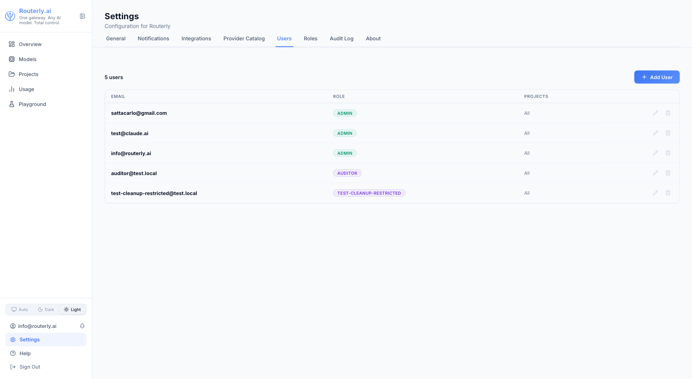
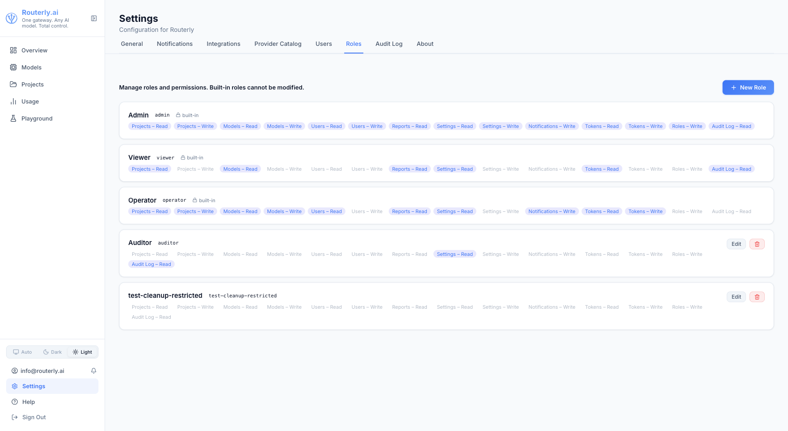

# Dashboard: Users & Roles

Routerly has a role-based access control (RBAC) system for the dashboard. Users are granted permissions via roles. Three built-in roles are provided; you can create additional custom roles with any combination of permissions.

---

## Permissions

| Permission | Description |
|-----------|-------------|
| `project:read` | View projects and their configuration |
| `project:write` | Create, edit, and delete projects |
| `model:read` | View registered models |
| `model:write` | Create, edit, and delete models |
| `user:read` | View dashboard users |
| `user:write` | Create, edit, and delete users, assign roles |
| `report:read` | View usage analytics and request logs |
| `settings:read` | View global settings |
| `settings:write` | Change global settings |
| `notification:write` | Manage notification channels and rules |
| `token:read` | View project tokens |
| `token:write` | Create and revoke project tokens |
| `role:write` | Create, edit, and delete custom roles |
| `audit:read` | Read the audit log |
| `modules:read` | View which modules are installed and enabled |
| `modules:manage` | Enable and disable modules |
| `connections:read` | View provider connections |
| `connections:manage` | Create, edit, and delete provider connections |
| `resilience:read` | View retry, timeout, and fallback settings |
| `resilience:manage` | Change retry, timeout, and fallback settings |
| `profiles:read` | View [routing profiles](./profiles.md) |
| `profiles:manage` | Create, edit, and delete routing profiles |
| `optimizers:read` | View the [optimizer](../concepts/optimizers.md) catalog, samples, and previews |
| `optimizers:manage` | Change a project's optimizer pipeline |
| `experiments:read` | View [experiments](./experiments.md) and their metrics |
| `experiments:manage` | Create, edit, and delete experiments, manage their tokens |

Permissions gated by a module (`experiments:*`, for instance) still answer
`403` while that module is disabled, whatever the role says.

---

## Built-in Roles

| Role | Permissions |
|------|-------------|
| `admin` | All permissions |
| `operator` | Everything except `user:write`, `role:write`, `settings:write`, `audit:read`, `modules:manage`, `resilience:*` |
| `viewer` | `project:read`, `model:read`, `report:read`, `settings:read`, `token:read`, `audit:read`, `modules:read`, `connections:read`, `profiles:read`, `optimizers:read`, `experiments:read` |

---

## Managing Users



### Adding a User

1. Open **Users** in the sidebar
2. Click **+ New User**
3. Enter the email address, password, and assign a role
4. Click **Create**

The new user can log in immediately.

### Editing a User

Click a row, or its **Edit** icon, to change the user's email, password, or
role. With `user:write` missing the row is inert and the icon is hidden.

### Removing a User

Click the **Delete** icon and confirm. The user's session is invalidated immediately.

---

## Custom Roles



Custom roles let you define granular permission sets for specific team members.

### Creating a Custom Role

1. Open **Roles** in the sidebar
2. Click **+ New Role**
3. Give the role a name (e.g. `billing_reviewer`)
4. Check the permissions this role should have
5. Click **Save**

Custom roles can be assigned to users the same way as built-in roles.

### Editing / Deleting a Custom Role

Click **Edit** to change the role's permissions. Users with this role are affected immediately.

Click **Delete** to remove the role. Users who had this role will lose their dashboard access. Reassign them first.

---

## Project-Level User Assignment

Users can also be assigned to specific projects (from the project's **Users** tab). This limits their access to that project without changing their global role.

---

## CLI Management

```bash
# List all users
routerly user list

# Add a user
routerly user add --email ops@example.com --role operator

# Remove a user
routerly user remove --email ops@example.com

# List roles
routerly role list

# Add a custom role
routerly role add --name billing_reviewer --permissions report:read

# Remove a custom role
routerly role remove --name billing_reviewer
```
